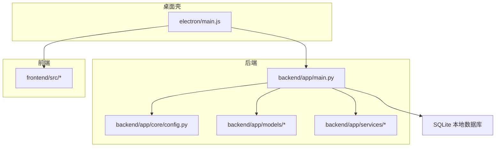
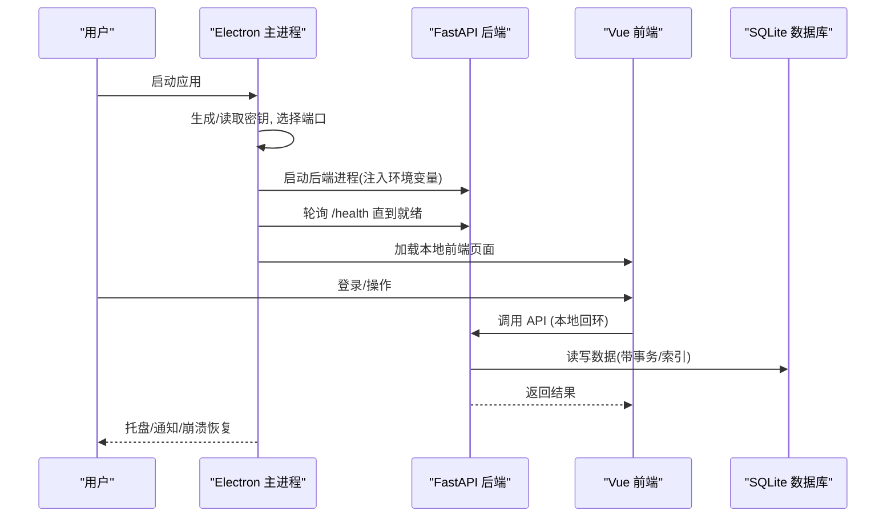
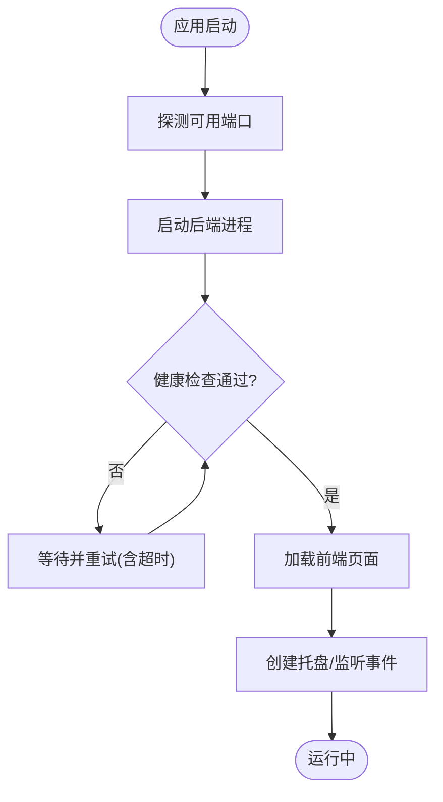
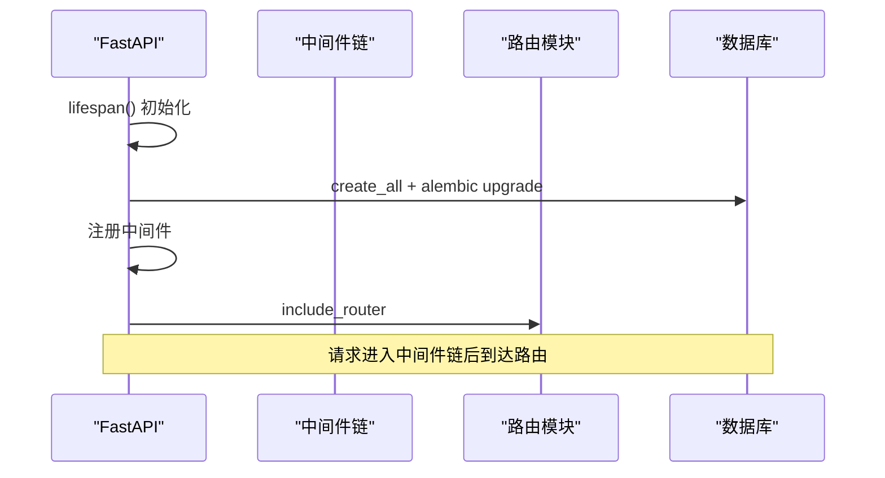
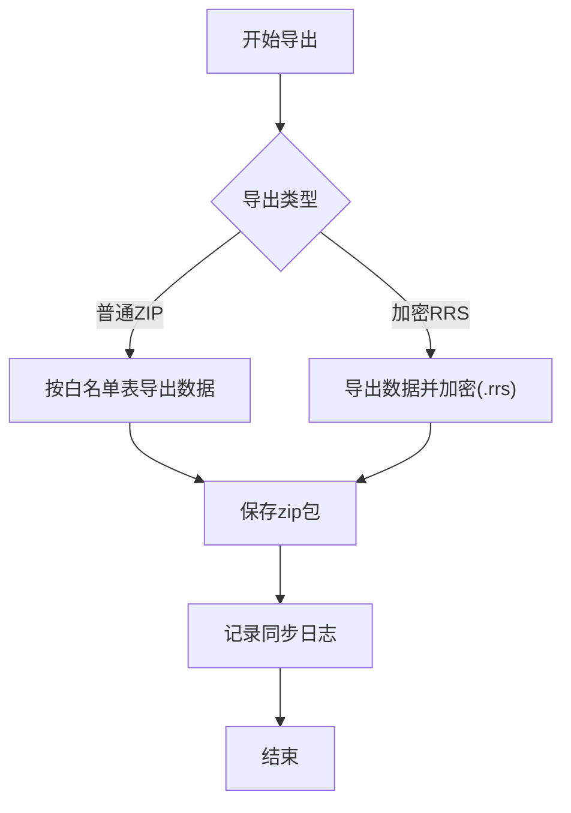
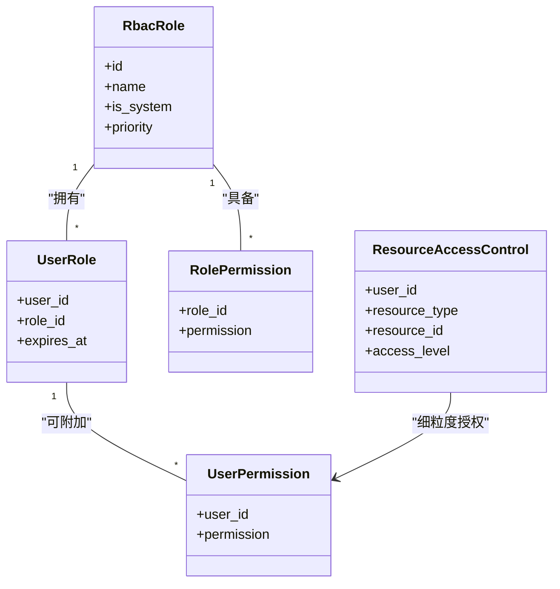
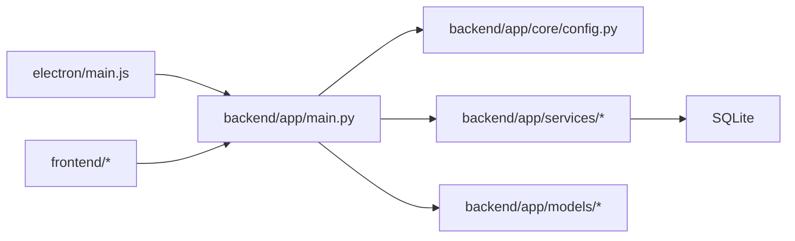

# 项目概述

<cite>
**本文引用的文件**
- [README.md](file://README.md)
- [backend/app/main.py](file://backend/app/main.py)
- [backend/app/core/config.py](file://backend/app/core/config.py)
- [backend/app/models/__init__.py](file://backend/app/models/__init__.py)
- [backend/app/services/data_sync_service.py](file://backend/app/services/data_sync_service.py)
- [backend/app/core/data_permission.py](file://backend/app/core/data_permission.py)
- [backend/app/models/rbac.py](file://backend/app/models/rbac.py)
- [frontend/package.json](file://frontend/package.json)
- [electron/main.js](file://electron/main.js)
</cite>

## 目录
1. [引言](#引言)
2. [项目结构](#项目结构)
3. [核心组件](#核心组件)
4. [架构总览](#架构总览)
5. [详细组件分析](#详细组件分析)
6. [依赖关系分析](#依赖关系分析)
7. [性能与可靠性](#性能与可靠性)
8. [故障排查指南](#故障排查指南)
9. [结论](#结论)

## 引言
本系统为“乡村振兴帮扶管理信息系统”，定位为完全离线的单机版桌面应用，支持多机协同数据同步。系统围绕乡村振兴工作场景，提供项目管理、经费管理、乡村工作管理、审批流程等核心能力，并通过加密数据包在离线环境下实现跨机器安全交换与合并导入。系统内置四级用户角色（super_admin/admin/user/viewer）与严格的数据权限隔离机制，确保不同组织与个人之间的数据边界清晰可控。

该系统采用前后端分离的桌面化架构：Electron 作为本地壳进程，内嵌 FastAPI 后端与 Vue3 前端，数据库使用 SQLite 本地文件存储；通过 Alembic 进行版本化迁移，配合启动时自动补列兜底策略，保障升级平滑。同时提供备份、审计、监控、任务队列等运维能力，满足基层单位在弱网或无网环境下的稳定运行需求。

**章节来源**
- [README.md:1-209](file://README.md#L1-L209)

## 项目结构
仓库采用模块化分层组织：
- backend：FastAPI 后端，包含路由、服务、模型、中间件、工具与脚本
- frontend：Vue 3 + TypeScript 前端，含页面、组件、状态管理与测试
- electron：桌面壳进程，负责生命周期管理、端口探测、健康检查、托盘与崩溃恢复
- deploy/docker/nginx：部署与容器化相关配置
- docs：产品与开发文档、架构图、数据字典等
- scripts：构建、质量门禁、运维脚本

**图表来源**
- [electron/main.js:1-120](file://electron/main.js#L1-L120)
- [backend/app/main.py:98-179](file://backend/app/main.py#L98-L179)
- [backend/app/core/config.py:54-183](file://backend/app/core/config.py#L54-L183)
- [backend/app/models/__init__.py:1-93](file://backend/app/models/__init__.py#L1-L93)

**章节来源**
- [README.md:155-180](file://README.md#L155-L180)
- [backend/app/models/__init__.py:1-93](file://backend/app/models/__init__.py#L1-L93)

## 核心组件
- 桌面壳（Electron）：进程管理、端口选择与健康检查、窗口与托盘、崩溃恢复、密钥持久化、日志与诊断
- 后端（FastAPI）：应用生命周期、中间件链、路由装配、数据库初始化与迁移、静态资源挂载、健康检查与关闭接口
- 数据层（SQLAlchemy + Alembic）：懒加载模型注册、表创建、增量/全量导出与导入、冲突处理、加密包格式
- 权限与安全：RBAC 模型、数据范围过滤、CSRF、CORS、速率限制、字段加密、审计日志
- 前端（Vue 3 + TS）：页面与组件、状态管理、菜单权限、可视化图表、离线模板与资源

**章节来源**
- [electron/main.js:1-120](file://electron/main.js#L1-L120)
- [backend/app/main.py:66-179](file://backend/app/main.py#L66-L179)
- [backend/app/core/config.py:54-183](file://backend/app/core/config.py#L54-L183)
- [backend/app/services/data_sync_service.py:87-114](file://backend/app/services/data_sync_service.py#L87-L114)
- [backend/app/core/data_permission.py:20-80](file://backend/app/core/data_permission.py#L20-L80)
- [backend/app/models/rbac.py:31-163](file://backend/app/models/rbac.py#L31-L163)
- [frontend/package.json:26-68](file://frontend/package.json#L26-L68)

## 架构总览
系统采用“桌面壳 + 本地后端 + 本地前端”的离线架构，通过 Electron 统一管理后端进程与前端页面，数据库与文件全部落盘于本机用户数据目录，避免外部依赖。

**图表来源**
- [electron/main.js:200-382](file://electron/main.js#L200-L382)
- [electron/main.js:430-505](file://electron/main.js#L430-L505)
- [backend/app/main.py:235-257](file://backend/app/main.py#L235-L257)
- [backend/app/core/config.py:331-364](file://backend/app/core/config.py#L331-L364)

## 详细组件分析

### 桌面壳（Electron）
- 进程与端口：首次启动探测可用端口并记录，重启复用端口避免前端连接失效；异常退出自动重试最多三次
- 健康检查：循环请求 /health，超时与错误日志写入诊断文件
- 安全：仅允许访问本机地址，白名单协议导航，渲染进程沙箱与上下文隔离
- 密钥与数据：secrets.json 加密存储（不可用时降级为受限权限明文），数据库路径按平台设置
- 托盘与交互：未读消息角标、快捷入口、最小化到托盘、关闭行为记忆

**图表来源**
- [electron/main.js:163-186](file://electron/main.js#L163-L186)
- [electron/main.js:200-382](file://electron/main.js#L200-L382)
- [electron/main.js:430-505](file://electron/main.js#L430-L505)

**章节来源**
- [electron/main.js:1-120](file://electron/main.js#L1-L120)
- [electron/main.js:200-382](file://electron/main.js#L200-L382)
- [electron/main.js:430-505](file://electron/main.js#L430-L505)

### 后端（FastAPI）
- 应用生命周期：启动时初始化数据库表、执行 Alembic 升级、创建索引、默认管理员种子、启动监控与定时任务
- 中间件链：慢请求监控、查询计数、审计、请求日志、CSRF、驼峰转换、缓存头、CORS、安全响应头、请求ID
- 静态资源：生产模式挂载前端构建产物，SPA fallback 保证前端路由
- 健康与关闭：/health 暴露迁移状态；/api/v1/shutdown 受内部密钥保护

**图表来源**
- [backend/app/main.py:66-179](file://backend/app/main.py#L66-L179)
- [backend/app/main.py:235-257](file://backend/app/main.py#L235-L257)
- [backend/app/main.py:397-428](file://backend/app/main.py#L397-L428)

**章节来源**
- [backend/app/main.py:66-179](file://backend/app/main.py#L66-L179)
- [backend/app/main.py:235-257](file://backend/app/main.py#L235-L257)
- [backend/app/main.py:397-428](file://backend/app/main.py#L397-L428)

### 数据同步（离线多机协同）
- 导出：按白名单表导出增量/全量数据，打包为 ZIP 或加密 .rrs（AES-256-GCM + PBKDF2-SHA256），记录元数据与哈希
- 导入：校验表名与列名，支持 skip/overwrite/merge/manual 冲突策略，敏感表禁止导入防提权
- 冲突处理：记录本地与导入数据差异，支持人工解决并落库
- 审计追踪：每次导出/导入均记录 DataSyncLog，便于追溯

**图表来源**
- [backend/app/services/data_sync_service.py:128-233](file://backend/app/services/data_sync_service.py#L128-L233)
- [backend/app/services/data_sync_service.py:576-704](file://backend/app/services/data_sync_service.py#L576-L704)
- [backend/app/services/data_sync_service.py:304-395](file://backend/app/services/data_sync_service.py#L304-L395)

**章节来源**
- [backend/app/services/data_sync_service.py:87-114](file://backend/app/services/data_sync_service.py#L87-L114)
- [backend/app/services/data_sync_service.py:128-233](file://backend/app/services/data_sync_service.py#L128-L233)
- [backend/app/services/data_sync_service.py:304-395](file://backend/app/services/data_sync_service.py#L304-L395)
- [backend/app/services/data_sync_service.py:576-704](file://backend/app/services/data_sync_service.py#L576-L704)

### 权限与数据隔离
- 角色体系：super_admin/admin/user/viewer，旧角色归一化兼容（approval_leader/manager→admin，operator→user）
- 数据范围：ALL（超级管理员）、OWN_DEPT（管理员，本组织及下级）、OWN（仅本人）
- 查询过滤：统一通过 apply_scope_to_query 注入 WHERE 条件，缺失 owner/organization 字段时 fail-closed 返回空集
- RBAC 模型：角色、用户角色关联、角色权限、用户直接权限、资源访问控制、访问日志、机器码功能权限

**图表来源**
- [backend/app/models/rbac.py:31-163](file://backend/app/models/rbac.py#L31-L163)

**章节来源**
- [backend/app/core/data_permission.py:20-80](file://backend/app/core/data_permission.py#L20-L80)
- [backend/app/core/data_permission.py:83-134](file://backend/app/core/data_permission.py#L83-L134)
- [backend/app/models/rbac.py:31-163](file://backend/app/models/rbac.py#L31-L163)

### 前端与桌面集成
- 技术栈：Vue 3 + TypeScript + Vite + Element Plus + ECharts + Leaflet + Pinia
- 权限：菜单可见性与按钮级权限由角色与权限包决定，写操作在后端二次校验
- 集成：Electron 注入环境变量与密钥，前端通过本地 API 与后端通信

**章节来源**
- [frontend/package.json:26-68](file://frontend/package.json#L26-L68)
- [electron/main.js:274-289](file://electron/main.js#L274-L289)

## 依赖关系分析
- 运行时依赖：FastAPI、SQLAlchemy、Pydantic、Alembic、SQLite、Element Plus、Vue 3、Electron
- 关键耦合点：
  - Electron 与后端：通过 HTTP 健康检查与 /shutdown 接口协作
  - 后端与数据库：Alembic 迁移与自动补列兜底共同维护 schema
  - 权限与业务：所有查询经数据范围过滤，RBAC 模型支撑菜单与接口鉴权
  - 同步服务与模型：基于白名单表与模型元数据动态确定可同步集合

**图表来源**
- [electron/main.js:200-382](file://electron/main.js#L200-L382)
- [backend/app/main.py:98-179](file://backend/app/main.py#L98-L179)
- [backend/app/core/config.py:54-183](file://backend/app/core/config.py#L54-L183)

**章节来源**
- [backend/app/models/__init__.py:1-93](file://backend/app/models/__init__.py#L1-L93)
- [backend/app/services/data_sync_service.py:87-114](file://backend/app/services/data_sync_service.py#L87-L114)

## 性能与可靠性
- 启动优化：模型懒加载减少启动时间；静态资源长期缓存；健康检查快速判定
- 数据库：WAL 模式、连接池调优、慢查询阈值、索引创建、每日 WAL checkpoint
- 任务调度：线程定时器用于备份、KPI 预计算、异常检测、待办提醒与周报
- 容错：后端异常退出自动重启（上限次数），渲染进程崩溃自动恢复，端口占用自动切换
- 安全：CSRF、CORS 收紧、速率限制、字段加密、审计日志、敏感表导入拦截

[本节为通用指导，不直接分析具体文件]

## 故障排查指南
- 后端无法启动
  - 检查端口是否被占用，查看 Electron 诊断日志
  - 确认数据库文件存在且可写，查看迁移状态与健康接口
- 页面加载失败
  - 确认 /health 可达，必要时触发页面重试
  - 检查 Electron 窗口重载逻辑与最大重试次数
- 数据导入失败
  - 查看同步日志中的 errors 与 conflicts，确认表名与列名合法性
  - 对敏感表导入将被拒绝，需调整策略或数据来源
- 权限问题
  - 确认用户角色与组织归属，检查数据范围过滤是否生效
  - 写操作会被后端二次校验，viewer 一律拒绝

**章节来源**
- [electron/main.js:188-197](file://electron/main.js#L188-L197)
- [electron/main.js:430-505](file://electron/main.js#L430-L505)
- [backend/app/services/data_sync_service.py:304-395](file://backend/app/services/data_sync_service.py#L304-L395)
- [backend/app/core/data_permission.py:83-134](file://backend/app/core/data_permission.py#L83-L134)

## 结论
本系统以“离线优先、多机协同”为核心设计理念，通过 Electron 封装本地后端与前端，结合 SQLite 与 Alembic 实现稳定的单机运行与平滑升级；借助加密数据包与严格的权限隔离，满足乡村振兴工作中项目管理、经费管理、乡村工作管理与审批流程等业务诉求。系统具备完善的监控、审计与容错机制，适合在无网或弱网环境下部署使用，帮助基层单位高效开展帮扶管理工作。

[本节为总结性内容，不直接分析具体文件]