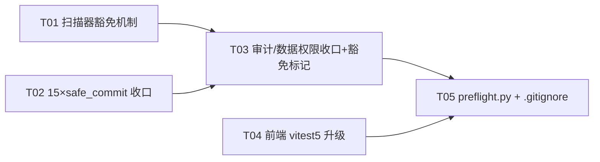

# R26 整改设计方案（架构评审）

- **批次**：R26
- **基线**：`main` @ `06c1e02b`（已推送，CI run #126 六项全绿）
- **作者**：架构师 高见远
- **目标**：落实全部收尾建议 —— ① `python scripts/security_audit.py --strict` 退出 0；② 前端 `vitest 3.2.7 → 5.0.0` 大版本升级并保持覆盖率门禁；③ 新增"提交前本地门禁"脚本 + `.scratch` 定向收敛。
- **本文档只做设计，不写实现代码。**
- **⚠️ 并发保护**：工作区有另一会话未提交改动（`backend/app/api/v1/files.py`、`CHANGELOG.md`、`.scratch/w14-deep-probe/001-r1-r2-probe-summary.md` 等）。R26 实现**不得触碰**这些文件。

---

## 0. 关键事实核验（先于设计）

| 事实 | 结论 | 证据 |
|---|---|---|
| 审计脚本严格模式语义 | 默认恒退出 0；`--strict` 时 `total>0` 才 `exit(1)` | `scripts/security_audit.py:295-296` |
| 当前告警总数 | **34** = Scan1(15) + Scan4(7) + Scan5(12) | 本地实跑 `--verbose` 复核 |
| Scan1 判定规则 | 行 `strip() == "db.commit()"` 即违规；含 `# noqa` 的行被跳过；`transaction.py` 排除 | `security_audit.py:45-78` |
| `safe_commit` 签名 | `safe_commit(db: Session, logger=None) -> bool`；commit 失败→`rollback()`→**重新抛出原异常** | `backend/app/core/transaction.py:256-289` |
| `write_work_log` 签名 | `write_work_log(db, log_type, action, entity_id, entity_name, **kwargs)`；`user_id` 为 NOT NULL，**None 时静默跳过**（返回 None） | `backend/app/services/work_log_service.py:58-99` |
| 数据权限 5 种等效写法 | `filter_by_data_scope`(=`apply_scope_to_query` 别名) / `apply_data_scope` / `apply_scope_filter` / `OrgScopeFilter.filter_by_org_ids` / `apply_scope_to_query` | `backend/app/core/data_permission.py:96,177,196,241,428` |
| 后端覆盖率门禁 | `backend/.coveragerc` `fail_under=100`、`precision=2`、`source=app`、脚本目录**不计入** | `.coveragerc:29,38,41` |
| 前端覆盖率门禁 | 12 组 glob `statements/branches/functions/lines` 全 100% | `frontend/vitest.config.ts:121-134` |
| vitest 5 前置条件 | **Node ≥ 22.12.0**、**Vite ≥ 6.4.0** | vitest 官方迁移指南 |
| 本仓现状 | Node CI=22（本地沙箱 22.22.2/25.2.1）；`vite ^7.3.6` ✅；`vitest ^3.2.7`、`@vitest/coverage-v8 ^3.2.7`、`@types/node ^20` | `frontend/package.json:50,65,67` |
| postinstall 补丁 | `frontend/scripts/patch-vitest-coverage.cjs` 打补丁到 `node_modules/vitest/dist/chunks/coverage.DfSpMS-b.js`，锚点为 **3.2.7 内部实现字符串**，锚点失配即 **fail-loud 退出非 0** → `npm ci` 失败 | 补丁脚本本体；`pr-checks.yml:112` |
| 前端用例规模 | 316 个测试文件（≈6024 用例），无 `.sequential`、无 `vitest/*` 已移除入口点引用、无 `@vitest/mocker` 直接引用 | 全仓 grep |

---

## ① 总体处置矩阵（34 项逐条三分类）

> 分类口径：**真阳性**＝必须改代码；**合理豁免**＝加显式豁免标记（扫描器识别）；**补调用/补注释**＝保留行为、补审计调用。
> 编号：`C**`=Scan1 裸 commit，`W**`=Scan4 无 work_log，`D**`=Scan5 无数据权限过滤。
> **风险**列指改动本身的回归风险（不含 100% 覆盖率补测成本，后者见 §③）。

### Scan 1 — 裸 `db.commit()`（15 项，**全部真阳性**，统一处置）

统一处置：`db.commit()` → `safe_commit(db)`；语义等价（成功返回 True；失败 rollback 后**抛原异常**，与裸 commit 的异常传播一致）。带 `try/except` 的位置，其原有 `except`/`rollback` 保留（safe_commit 已回滚，二次 rollback 无害）。**无一处处于 `with transaction(db)` 块内**（已核验上下文），不存在重复提交。

| ID | 位置 | 分类 | 处置 | 风险 |
|---|---|---|---|---|
| C01 | `api/v1/control_package.py:245` | 真阳性 | 替换 `safe_commit(db)`；**需新增 import** | 低 |
| C02 | `api/v1/funds.py:890` | 真阳性 | 替换（已在 `try/except` 内，日志失败不阻断主流程，语义保持） | 低 |
| C03 | `api/v1/machine_code.py:465` | 真阳性 | 替换（已 import safe_commit） | 低 |
| C04 | `api/v1/org_module_policy.py:130` | 真阳性 | 替换；**需新增 import** | 低 |
| C05 | `api/v1/org_module_policy.py:162` | 真阳性 | 替换（同上） | 低 |
| C06 | `api/v1/subordinate_registry.py:102` | 真阳性 | 替换；**需新增 import** | 低 |
| C07 | `api/v1/subordinate_registry.py:144` | 真阳性 | 替换 | 低 |
| C08 | `api/v1/subordinate_registry.py:196` | 真阳性 | 替换 | 低 |
| C09 | `api/v1/subordinate_reports.py:185` | 真阳性 | 替换；**需新增 import** | 低 |
| C10 | `api/v1/subordinate_reports.py:221` | 真阳性 | 替换 | 低 |
| C11 | `api/v1/auth/auth.py:518` | 真阳性 | 替换（`try/except` 内 logout 路径，异常仍被捕获记 warning） | 低 |
| C12 | `api/v1/system/admin.py:460` | 真阳性 | 替换；**需新增 import**（`try/except` 内，强制下线 token_version） | 低 |
| C13 | `api/v1/system/admin.py:495` | 真阳性 | 替换（无 try 包裹；异常传播行为与裸 commit 一致） | 低 |
| C14 | `services/effectiveness_service.py:197` | 真阳性 | 替换；**需新增 import**（rank 回写后提交） | 低 |
| C15 | `services/rural_work_service.py:466` | 真阳性 | 替换（`try/finally: db.close()`，异常经 finally 关闭会话后传播，语义不变；已在 import safe_commit） | 低 |

> **需新增 import 的文件（6 个）**：`control_package.py`、`org_module_policy.py`、`subordinate_registry.py`、`subordinate_reports.py`、`system/admin.py`、`services/effectiveness_service.py`。统一写法：`from app.core.transaction import safe_commit`。

### Scan 4 — 有写路由但无 `write_work_log`（7 项：**2 真阳性 + 5 合理豁免**）

| ID | 模块 | 事实核验 | 分类 | 处置 | 风险 |
|---|---|---|---|---|---|
| W01 | `api/v1/ai.py` | POST `/analyze`、`/recommendations` 仅委托 `ai_service_manager`，**全程无 `db.add/commit`**（`ai_service.py` 无写库） | 合理豁免 | 加模块级豁免标记（只读分析，POST 仅承载复杂查询体） | 低 |
| W02 | `api/v1/ai_enhanced.py` | `/predict`、`/anomaly-detection`、`/recommendations/fund-allocation`、`/nlp-query` 全部为只读计算/推荐 | 合理豁免 | 加豁免标记 | 低 |
| W03 | `api/v1/data_quality.py` | `/validate`、`/clean`、`/deduplicate`、`/validate-rules` 均在**请求载荷内存态**上做变换并回传，**不落库**（clean/dedup 只回 `cleaned_records`） | 合理豁免 | 加豁免标记 | 低 |
| W04 | `api/v1/effectiveness.py` | POST `/evaluate` **落库** `EffectivenessEvaluation`（"…计算三唯分数并落库"）+ 创建审批任务 | **真阳性** | commit 成功后补 `write_work_log(db,"effectiveness","evaluate",village_id,...)`（`try/except` 不阻断主流程） | 中 |
| W05 | `api/v1/offline_map.py` | POST `/download`、DELETE `/clear` 为 `require_admin()` 运维操作（瓦片缓存），无业务实体 | 合理豁免 | 加豁免标记（管理员运维，无业务实体变更） | 低 |
| W06 | `api/v1/performance.py` | DELETE `/slow-queries`、POST `/cache/clear` 为超管运维（清慢查询/缓存） | 合理豁免 | 加豁免标记 | 低 |
| W07 | `api/v1/permission_package.py` | POST `/confirm/{file_name}` **镜像写 RBAC 权限**（删除+重建系统角色外的权限配置） | **真阳性** | `confirm_import` 成功后补 `write_work_log(db,"permission_package","import",...)` | 中 |

> **拒绝方案**：给 W01/W02/W03/W05/W06 补"真实 work_log"会给只读分析与运维清理端点引入每次调用的 DB 写入与 `write_work_log` 的 `user_id` NOT NULL 约束风险，属行为负优化；**改路由 POST→GET 会破坏 API 契约与前端/E2E**。故取豁免。

### Scan 5 — 查询组织模型但无数据权限过滤（12 项：**2 真阳性 + 10 合理豁免**）

| ID | 文件 | 事实核验（命中 `db.query(User/Village/…)` 处） | 分类 | 处置 | 风险 |
|---|---|---|---|---|---|
| D01 | `api/v1/control_package.py` | `db.query(User).filter(User.organization_id == org_id)`，**`org_id` 来自请求体**，仅校验 `role ∈ (admin,super_admin)` → 部门级 admin 可传入**其它组织** id 导出该组织用户/RBAC/系统配置（跨组织数据外泄） | **真阳性** | 生成前加**目标组织可及性守卫**（超管放行；其余按组织子树校验，复用 `OrgScopeFilter`/`apply_scope_filter` 语义），越权 403 | **中** |
| D02 | `api/v1/machine_code.py` | 仅按 `username`/`id` 定位 `User`（发码/授权/改密），非枚举 | 合理豁免 | 加豁免标记（身份定位 + 管理员端点） | 低 |
| D03 | `api/v1/menus.py` | `db.query(User).filter(User.id == user_id)` 设置用户菜单（管理员） | 合理豁免 | 加豁免标记（按主键定位的身份域） | 低 |
| D04 | `api/v1/organization.py` | 按 `User.organization_id` 列组织成员，属**组织域自身管理** | 合理豁免 | 加豁免标记（组织管理域，加数据权限会破坏组织成员维护） | 低 |
| D05 | `api/v1/permission_package.py` | 按 `username` 解码导入者身份（管理员/离线本机导入） | 合理豁免 | 加豁免标记（身份解码） | 低 |
| D06 | `api/v1/permission_packs.py` | `User.permission_pack_id` 聚合与 `User.id.in_()`（RBAC 管理域） | 合理豁免 | 加豁免标记（RBAC 管理域） | 低 |
| D07 | `api/v1/subordinate_reports.py` | `db.query(User).filter(User.is_active==True).all()` 生成"本系统全部注册用户"上报包；单机/单单位部署下 `organization_id` 多为 NULL | 合理豁免 | 加豁免标记（部署级上报包；加 org 过滤会在 NULL-org 单机模式返回空集，破坏功能） | 低 |
| D08 | `api/v1/auth/users.py` | 本人资料 + 管理员用户列表/统计（身份与认证域） | 合理豁免 | 加豁免标记（认证/身份域） | 低 |
| D09 | `api/v1/auth/user_management.py` | 管理员用户 CRUD/统计 | 合理豁免 | 加豁免标记（管理员用户域） | 低 |
| D10 | `api/v1/data/data/reports.py` | `service.db.query(SupportedVillage)`（`comprehensive` 列表 + `statistics` 计数）**无任何组织过滤** → 跨组织村数据进入报表 | **真阳性** | 两处查询用 `filter_by_data_scope(query, SupportedVillage, current_user, db=service.db)` 包裹 | **中** |
| D11 | `api/v1/system/admin.py` | 超管系统管理（用户/项目/村计数、强制下线、2FA 重置） | 合理豁免 | 加豁免标记（超级管理员全局管理域） | 低 |
| D12 | `api/v1/system/init.py` | 系统初始化引导（创建首个管理员） | 合理豁免 | 加豁免标记（系统级 bootstrap，无数据权限主体） | 低 |

### 三分类汇总

| 分类 | Scan1 | Scan4 | Scan5 | 合计 |
|---|---|---|---|---|
| **真阳性（改代码）** | 15 | 2 | 2 | **19** |
| **合理豁免（加标记）** | 0 | 5 | 10 | **15** |
| **合计** | 15 | 7 | 12 | **34** |

> 达到 `--strict` 退出的充要条件：19 项真阳性修完后，15 项豁免必须被扫描器**显式识别**（见 §②-T01 的豁免机制）。

---

## ② 三块方案的实现顺序与依赖

### 2.1 块 A：`security_audit.py` 34 项告警处置

#### A-0 豁免机制（T01，**关键路径，先行**）

**问题**：15 项豁免（5×work_log + 10×data_scope）在代码中**没有**可用的既有约定——Scan1 的 `# noqa` 行级约定对 Scan4/5 不适用。若强行给身份/管理/引导端点加"数据权限过滤"，会破坏功能（D04/D07/D11/D12）或对外泄风险做错误减法。因此必须让扫描器**显式识别豁免**。

**设计（最小、可测、防滥用）**——在 `scripts/security_audit.py` 内新增：

```python
# 豁免指令约定：位于模块文件内任意位置，必须携带不可为空、≥8 字符的理由
#   # security-audit: exempt <rule> — <reason>
# <rule> ∈ {commit, work_log, data_scope}
EXEMPTION_RE = re.compile(
    r"#\s*security-audit:\s*exempt\s+(commit|work_log|data_scope)\b[^\n]*?[—\-–:]\s*(\S.{7,})"
)

def _find_exemption(content: str, rule: str) -> str | None:
    """返回豁免理由（≥8 字符）；无有效豁免返回 None。无理由的标记不生效。"""
    for m in EXEMPTION_RE.finditer(content):
        if m.group(1) == rule:
            return m.group(2).strip()
    return None
```

- **Scan1**：保留现有 `# noqa` 行级约定；额外支持行级 `# security-audit: exempt commit — 理由`（本批 15 项已全部用 `safe_commit` 真修，无需用到）。
- **Scan4**：在 `has_work_log` 判定**之前**插入 `if _find_exemption(content, "work_log"): continue`（连同 `--verbose` 时打印 `exempt (reason)`）。
- **Scan5**：在 `has_data_scope` 判定**之前**插入 `if _find_exemption(content, "data_scope"): continue`。
- **防滥用硬约束**：
  1. 理由串**必须 ≥8 字符**，无理由标记**不生效**（防止用空标记批量消警）。
  2. **严格模式下仍要把豁免项打到 stderr**（`exempt: <rel_path> — <reason>`），保持可见性、不可静默。
  3. 新增单测锁定：`test_security_audit_exemptions.py`（见下），确保①有效标记被识别、②无理由标记**不**被识别、③规则名不匹配不误伤。
- **豁免标记落点**：写入各模块**文件头 docstring 之后 / import 区之前**的顶层注释（不污染 docstring）。示例：
  - `ai.py`：`# security-audit: exempt work_log — 只读AI分析端点，POST 仅承载复杂查询体，全程不落库`
  - `system/init.py`：`# security-audit: exempt data_scope — 系统初始化引导，创建首个管理员，无数据权限主体`
  （15 条标记的具体文案在实现时逐条落地，理由须与 §① 矩阵一致。）

> **为何改扫描器而非纯改代码**：15 项豁免中 D04/D07/D11/D12 加过滤会破坏功能，D02/D03/D05/D06/D08/D09 属身份域，加过滤语义错误；W01/W02/W03/W05/W06 属只读/运维。纯代码方案要么破坏功能、要么制造"假过滤"。带理由的显式豁免 + 单测 + 可见性，是唯一既达 `--strict=0` 又不失真审计的方案。此改动**仅作用于脚本**（`source=app` 不计入后端覆盖率），零覆盖率成本。

**A-0 回归测试落点**：`backend/tests/unit/test_security_audit_exemptions.py`（直接 `import` 脚本模块或 `subprocess` 调 `--strict` 于临时夹具目录），锁死上述 3 条防滥用行为。

#### A-1 真阳性修复（T02 / T03）

- **T02 事务收口**：15 处 `db.commit()` → `safe_commit(db)`；6 个文件补 import。**等语义、低风险**。
- **T03 审计与数据权限收口**：
  - W04 `effectiveness.py`：`evaluate_village` 主流程 commit 后补 `write_work_log`（`try/except` 包裹，失败不阻断）。
  - W07 `permission_package.py`：`confirm_import` 成功后补 `write_work_log`。
  - D01 `control_package.py`：`generate_control_package` 入口加目标组织可及性守卫（越权 403）。
  - D10 `data/data/reports.py`：`comprehensive` 列表查询与 `statistics` 计数查询各包一层 `filter_by_data_scope(...)`。
  - 15 项豁免标记落地。

> **⚠️ 100% 覆盖率联动**：后端 `fail_under=100`、前端 12 组 100%。C01–C15 是**等长行替换**（被覆盖行→仍被覆盖行），中性；但 T03 新增的 `write_work_log(...)`、组织守卫的 `if/raise` 分支、`filter_by_data_scope(...)` 包裹行**是可执行新行/新分支，必须同步补测**，否则门禁直接变红。T03 交付物必须包含对应测试（见 §③）。

### 2.2 块 B：前端 vitest 3.2.7 → 5.0.0

> **状态（2026-09-11）：已回滚并暂缓。** 该升级曾以「半成品」形态进入 main：`vitest` 到 `^5.0.0` 而 `@vitest/coverage-v8` 仍在 `^3.2.7`，并且 v5 打包产物使 `frontend/scripts/patch-vitest-coverage.cjs` 锚点失配而 fail-loud（“存在多个 coverage.*.js”）→ postinstall 失败 → `npm ci` 整体失败 → CI 的 frontend-check / security / e2e-test 三任务全红（60cea85f）。现已回到 `vitest ^3.2.7`（与 coverage-v8 同版本线、与补丁锚点匹配），本块作为后续专项：需同步升 `@vitest/coverage-v8`、重定补丁锚点（或确认 v5 真正自治 #9758 后删除补丁）、重标定 12 项覆盖率阈值，并在 Linux CI 上验证分片读回不再出 ENOENT。（依据：frontend/vitest.config.ts 注释 (B)、CHANGELOG 1.12.1 R31 条目、本次 CI 诊断）

**动机**：`npm audit` 报 `GHSA-82fw-gwwq-j7x9`（`@vitest/mocker` 路径穿越，CVSS 5.9，**中危**），唯一修复版本 5.0.0（major）。
**注意**：CI 的 `npm audit --audit-level=high` **不阻断中危**，故当前 CI 绿地不含此告警；本次升级属**主动硬化**，非阻塞项。

#### B-1 需同步升级的包

| 包 | 现值 | 目标 | 依据 |
|---|---|---|---|
| `vitest` | `^3.2.7` | `^5.0.0` | GHSA 唯一修复版本 |
| `@vitest/coverage-v8` | `^3.2.7` | `^5.0.0` | 与 vitest 主版本强绑定 |
| `@types/node` | `^20.11.19` | `^22` | vitest 5 要求 `@types/node` ^22 或 ≥24 |
| `vite` | `^7.3.6` | **不变** | vitest 5 要求 Vite ≥6.4，`7.3.6` 满足 |
| `@vitejs/plugin-vue` | `^5.0.4` | 校验；若 vite 7 + vitest 5 报 peer 冲突则升 `^6` | vitest 5 经 Vite 6 Environment API 解析工程 |
| `jsdom` | `^24.1.0` | 校验；必要时升最新 | environment=jsdom 兼容性 |
| `package-lock.json` | — | 随 `npm install` 重算 | 锁定 |

> CI/本地一律用 **Node 22**（≥22.12；与 `.github` 的 `node-version: '22'` 一致）。**不要**用 Node 25 作为门禁权威——历史多次证明"Windows 本地/非 CI Node 绿"不代表 Linux CI 绿。

#### B-2 破坏性变更与本仓影响（逐条已核验）

| 变更 | 本仓影响 | 处置 |
|---|---|---|
| `clearMocks` 默认 `true` | 现配置**未设置** → v5 会在每个用例前 `vi.clearAllMocks()`，可能让"跨用例累计 mock 调用数"的断言失败 | **显式 `clearMocks: false`**（零行为变更，先保住 6024 用例全绿；后续再单独立项清理跨用例 mock 依赖） |
| `test.sequential` / `describe.sequential` 移除 | 全仓 **0 处** | 无需处理 |
| `vi.mock`/`vi.hoisted` 非顶层即抛 | `vi.hoisted` 239 处（模板均顶层）；缩进 `vi.mock(` 0 处 | 升级后跑全量确认；如抛错再定位 |
| 未 `await` 的 `resolves/rejects` 断言由"静默通过"改为**失败** | 未知，需全量跑暴露 | 升级后据失败清单补 `await` |
| `vitest/coverage`、`vitest/reporters`、`vitest/mocker` 等入口移除 | 全仓 **0 处**引用 | 无需处理 |
| 测试产物移入 `.vitest/`（html/json/junit/blob/截图） | 本仓 vitest.config 的 **coverage** reporter（`['text','json','html']`，L80）**不受影响**；nightly 用 `--reporter=junit --outputFile=test-results.xml`（显式 outputFile，**仍被尊重**） | 校验 coverage 目录仍为 `frontend/coverage/`（nightly 上传路径）；`.gitignore` 增 `.vitest/` |
| glob 覆盖率阈值不再继承顶层 `perFile` | 本仓 12 组 glob 未用 perFile、顶层也未设 | 无影响 |
| 覆盖率切换到 `@vitest/istanbuljs`（istanbul 侧） | 本仓用 **v8** provider，不受 istanbul 换包影响 | 观察 v8 分片行为变化 |
| **覆盖率内部实现（BaseCoverageProvider）变更** | **直接冲击 `patch-vitest-coverage.cjs`（见 B-3）** | **最高风险项** |

#### B-3 postinstall 补丁（#9758）——**升级的第一阻塞点**

`frontend/scripts/patch-vitest-coverage.cjs` 把 SITE1/SITE2/SITE3 补丁锚定到 vitest 3.2.7 打包产物 `node_modules/vitest/dist/chunks/coverage.DfSpMS-b.js` 的**精确内部字符串**（`promises$1.writeFile(filename, JSON.stringify(coverage), "utf-8")` 等）。该脚本 **fail-loud**：锚点缺失即 `exit(1)`，会让 `npm ci`（`pr-checks` + `nightly` 的 `postinstall`）**整体失败**。

**处置流程**：
1. `cd frontend && npm install --ignore-scripts`（先绕开 postinstall，避免半成品失败）。
2. 定位 v5 覆盖率实现载体：可能仍在 `node_modules/vitest/dist/chunks/`，也可能迁到 `node_modules/@vitest/coverage-v8/dist/`。更新 `resolveTargetFile()` 的探测根。
3. **判定上游是否已修 #9758**：
   - 若 v5 已根治 → **删除补丁**：移除 `postinstall`、`pr-checks.yml:112` 的显式补丁步骤、`src/test/setup.ts:11` 的 `mkdir('coverage/.tmp')` 兜底，并更新 `vitest.config.ts` 注释 (B)。
   - 若仍复现 → **重推导锚点**：在 v5 产物中检索等价的"写分片 / 读分片"调用字符串，重写 SITE1/SITE2/SITE3，保持 fail-loud + 幂等 + 写后校验语义；同步 `src/test/setup.ts` 的 `.tmp` 路径（若 v5 迁移了临时目录）。
4. **验证 #9758 是否复现**：全量 `npx vitest run --coverage` 连续跑 ≥2 次（该竞态为概率性）观察是否 ENOENT。

> **兜底**：若 v5 产物中已**不存在**可锚定的等价调用（实现被彻底重写），且 #9758 无法确认修复，则本块**回退**（见 B-6）。

#### B-4 配置调整清单（`frontend/vitest.config.ts`）

- 新增 `clearMocks: false`（保 v3 语义）。
- 保留 `maxWorkers:1`/`minWorkers:1`/`fileParallelism:false`/`retry:1`（内存与时序 flake 缓解，与 Node 版本无关）。
- 保留 12 组 glob 100% 阈值（格式 v5 兼容）。
- 保留 `provider:'v8'`、`reporter:['text','json','html']`、`reportOnFailure:true`。
- 注释 (A) 结论"每个被门槛锁定的 .vue 全仓只允许一个测试文件执行"**继续有效**，升级后须以全量实测复核（若 v5 覆盖率重写使其失效，则更新注释并评估是否移除 `maxWorkers:1`，但**默认保留**）。
- `.gitignore` 增 `.vitest/`。

#### B-5 保持 100% 门禁与全量用例通过的验证协议

1. Node 22.22.2 下 `npm install`（含重推导后的 postinstall）。
2. `npx vue-tsc --noEmit`、`npm run lint:check` 绿。
3. `npx vitest run --coverage` 全量：要求 **≈316 文件 / 6024 用例全通过** + **12 组 glob 全 100%**；连续 ≥2 次稳定（竞态验证）。
4. 四类破坏性变更若暴露失败，按 B-2 逐条修（优先 `await`、`clearMocks:false`、非顶层 mock 改顶层）。
5. **本地 Windows 全绿不作为放行依据**——升级 PR 必须在 **CI（Linux/Node22）** 复核通过方可合并。

#### B-6 回退方案

- `package.json` + `package-lock.json` 的升级改动**单独一个 commit**；回退 = `git revert` 该 commit，恢复 vitest 3.2.7 绿地。
- 因告警为**中危、仅 dev/测试期、不被 `--audit-level=high` 阻断**，回退后可选择"**风险接受 + 到期复查**"：在 `AGENTS.md`/`CHANGELOG` 登记 GHSA-82fw 为已评估的 dev-only 中危、附复查期限，保持 CI 绿。
- 触发回退的硬条件：① 全量用例无法在不改变业务断言的前提下全绿；② 12 组覆盖率无法维持 100%（且差距源于 v5 覆盖率口径而非真实缺口）；③ #9758 无法根治且无法重锚点。

### 2.3 块 C：本地门禁脚本 + `.scratch` 收敛

#### C-1 `scripts/preflight.py`（仓库内确认**无同类脚本**，仅零散 `check_*.py` / `verify_deb_smoke.sh`，非重复）

- **路径**：`scripts/preflight.py`（Python；本仓 Windows 开发 + Linux CI 双平台，`.sh` 在 Windows 不可用）。
- **职责**：一次跑齐镜像 CI 六 job 的本地门禁，输出**清晰的 PASS/FAIL 摘要 + 统一退出码**（任一阻断门禁失败 → `exit 1`）。
- **门禁映射**：

| 门 | CI job | 本地命令（要点） |
|---|---|---|
| G1 | backend-test | `cd backend && <py> -m pytest tests/ -q --cov=app`（阈值由 `.coveragerc fail_under=100` 承载） |
| G2 | frontend-check | `cd frontend && npx vue-tsc --noEmit && npm run lint:check && npx vitest run --coverage` |
| G3 | lint | `cd backend && <py> -m flake8 app/ --max-line-length=120 --count --max-complexity=16` + `bandit -r app/ -ll`（mypy 非阻断） |
| G4 | security | `cd frontend && npm audit --audit-level=high`（`pip-audit` 非阻断） |
| G5 | static-analysis | `python backend/scripts/check_soft_delete_usage.py` + `node scripts/sync-version.js --check` + `python scripts/check_menu_alignment.py` + **`python scripts/security_audit.py --strict`** |
| G6 | e2e-test | `cd frontend && npx playwright test`（重；`--fast`/`--skip-e2e` 跳过） |

- **骨架**：`argparse`（`--fast` / `--skip-e2e` / `--only G1,G5` / `--python <path>`）；逐门 `subprocess.run(cwd=..., capture_output=True)`，实时 `tee` 到控制台并落 `LOG`；末尾打印 `G1..G6 PASS/FAIL/SKIP` 表格与 `Total: N gates, M failed`，任一 FAIL → 非 0。
- **解释器解析**：默认 Windows `backend/.venv/Scripts/python.exe`、Linux `backend/.venv/bin/python`，可用 `--python` 覆盖（沙箱内 PATH 有 bug，须传绝对路径）。
- **平台细节**：Windows 用 `npx.cmd`/`npm.cmd`；`shell=False` 优先。
- **可选**：在 `Makefile` 增 `preflight:` 目标转发到该脚本（与既有 `deploy-check` 并存，不替换）。

#### C-2 `.scratch` 定向收敛（`.gitignore`）

现状：`.scratch/**` 下 **全部已跟踪文件均为 `*.md`**（探测/决策记录）；未跟踪产物为 `*.txt/*.json/*.py/*.db*/*.log` 及 `r25-run/` 目录。`.gitignore` 第 151 行附近已有 "Temp scratch scripts & test outputs" 段。

**规则设计**（只忽略产物类型，**不触碰 `*.md`**；已跟踪文件不受影响，仍保留在版本库）：

```gitignore
# ===== .scratch 探测产物（保留已跟踪的 *.md 记录；忽略自动化会话临时产物）=====
# 依据：.scratch/** 下已纳入版本控制的文件【全部为 .md】，下列后缀均为并发
# 会话生成的临时探测产物（日志/快照/脚本/临时库），不入库。
.scratch/**/*.txt
.scratch/**/*.json
.scratch/**/*.py
.scratch/**/*.log
.scratch/**/*.db*
.scratch/**/r25-run/
```

- 放在第 151 行段落**之后**新建独立小节，避免与"Temp scratch scripts"混淆。
- `*.db*` 一次性覆盖 `r25.db` / `r25.db-shm` / `r25.db-wal` / `r25.db.integrity_check`。
- `001-r1-r2-probe-summary.md` 等**已跟踪 md 不受任何影响**（gitignore 只作用于未跟踪文件）；该文件当前被并发会话修改，**R26 不动它**。
- 收敛后 `git status` 应只剩该 md 的并发改动 + R26 自身改动。

### 2.4 实现顺序与依赖图（Part B 任务分解）

| Task | 名称 | 源文件 | 依赖 | 优先级 |
|---|---|---|---|---|
| **T01** | 审计脚本豁免机制 + 回归测试 | `scripts/security_audit.py`、`backend/tests/unit/test_security_audit_exemptions.py` | — | P0 |
| **T02** | 后端事务收口（15× `safe_commit`） | `control_package.py`、`funds.py`、`machine_code.py`、`org_module_policy.py`、`subordinate_registry.py`、`subordinate_reports.py`、`auth/auth.py`、`system/admin.py`、`services/effectiveness_service.py`、`services/rural_work_service.py` | — | P0 |
| **T03** | 审计/数据权限收口 + 15 项豁免标记 + 补测 | 上述 10 文件 + `effectiveness.py`、`permission_package.py`、`ai.py`、`ai_enhanced.py`、`data_quality.py`、`offline_map.py`、`performance.py`、`menus.py`、`organization.py`、`permission_packs.py`、`auth/users.py`、`auth/user_management.py`、`data/data/reports.py`、`system/init.py` + 对应测试 | **T01** | P0 |
| **T04** | 前端 vitest 3→5 升级 | `frontend/package.json`、`frontend/package-lock.json`、`frontend/vitest.config.ts`、`frontend/scripts/patch-vitest-coverage.cjs`、`frontend/src/test/setup.ts`、`.github/workflows/pr-checks.yml`、`.gitignore` | — | P1 |
| **T05** | 本地门禁脚本 + .scratch 收敛 | `scripts/preflight.py`、`.gitignore`、`Makefile`(可选) | （建议在 T02–T04 后，便于验证） | P1 |



> 任务分组满足硬约束：≤5 个任务；除 T01 外任务尽量平铺；配置文件（`package.json`/lock/config）集中在 T04，`.gitignore` 在 T04/T05 内单点处理不散落。

---

## ③ 共享约定（工程师落地范式）

### 3.1 事务（Scan1）

- 统一：`from app.core.transaction import safe_commit`；`db.commit()` → `safe_commit(db)`。
- **语义**：`safe_commit` 成功返回 `True`；失败 `rollback()` 后**抛出原始异常**——与裸 `db.commit()` 的异常传播**逐点等价**。
- **禁止**在 `with transaction(db)` / `@transactional` / `with_transaction()` 管理的块内再调 `safe_commit`（会重复提交）。**已核验**本批 15 处均不在此类块内。
- `try/except` 已有的 `db.rollback()` 保留（safe_commit 已回滚，二次 rollback 无害）；不要在 `except` 中吞异常改变既有 HTTP 行为。

### 3.2 工作日志（Scan4 真阳性）

- 统一：`from app.services.work_log_service import write_work_log`。
- 签名：`write_work_log(db, log_type, action, entity_id, entity_name, **kwargs)`；`kwargs` 传 `user_id`（**NOT NULL，None 会被静默跳过并 warning**）、`username`、`detail`。
- **调用时机**：主变更 `safe_commit` **成功之后**；**必须**用 `try/except Exception: logger.debug("记录工作日志失败", exc_info=True)` 包裹，审计失败**不得阻断主流程**（与 `org_module_policy.py:132-140`、`machine_code.py:220` 现成范式一致）。
- 范例（W04）：`write_work_log(db, "effectiveness", "evaluate", request.village_id, f"评估村庄{request.village_id}-{request.year}", user_id=current_user.id, username=getattr(current_user,"username",""))`。

### 3.3 数据权限（Scan5 真阳性）

`app/core/data_permission.py` 现成工具，按场景选用（5 种写法扫描器均认可）：

| 场景 | 工具 |
|---|---|
| 内部列表/导出（部门级 admin 严格限本组织） | `filter_by_data_scope(query, model, user, db=None, org_field="organization_id")`（= `apply_scope_to_query` 别名） |
| 组织树端点（map/dashboard 等 admin 全量语义） | `apply_scope_filter(query, user, model, db=db)` |
| 精确 org-id 集合/子树 | `OrgScopeFilter(is_admin, org_ids, self_only, user_id).filter_by_org_ids(query, *org_id_cols, created_by_column=...)` |
| 单记录访问判定 | `check_record_access(record, user, ...)` / `require_data_permission(...)` |

- D10：`filter_by_data_scope(villages_query, SupportedVillage, current_user, db=service.db)`；`statistics` 计数同法包裹后再 `.count()`。
- D01：目标组织守卫建议复用 `OrgScopeFilter`/`get_org_scope` 的组织子树语义（见 §④ 待明确）。

### 3.4 覆盖率不变量（**最高优先约束**）

- 后端 `fail_under=100` + 前端 12 组 100%：**任何新增可执行行/分支都必须有测试覆盖**。
- 豁免**标记是注释**，零覆盖成本；`safe_commit` 替换是**等长行替换**，覆盖中性。
- **仅** T03 的新增调用/分支需要补测：
  - W04：覆盖 `evaluate` 成功路径的 work_log 调用（若 `write_work_log` 的 `user_id is None` 防御分支被计入，需相应覆盖）。
  - W07：覆盖 `confirm_import` 成功路径。
  - D01：组织守卫的**允许**与**拒绝(403)**两条分支各一测。
  - D10：`comprehensive` 与 `statistics` 两条报表分支各一测（确保新包裹行被命中）。

### 3.5 交付与门禁

- 提 PR 前：`python scripts/preflight.py`（或 `--fast` 跳过 E2E）全绿。
- R26 完成后必须核验：`python scripts/security_audit.py --strict; echo $?` → **0**。
- 版本/CHANGELOG：**不修改** `CHANGELOG.md`（并发会话持有），由主理人统一收口。

---

## ④ 待明确事项 / 假设

1. **D01 组织守卫语义**：`control_package.py` 的目标组织校验应使用"组织子树可及"（`OrgScopeFilter` + `get_org_scope` 递归子树）还是"本组织相等"？取决于产品对"上级 admin 可否为下级单位出包"的预期。**默认假设**：超管放行、非超管仅允许其组织子树内（与 `apply_scope_filter` 语义一致）。
2. **D07 是否长期豁免**：`subordinate_reports.py` 的"全量用户"上报包在**多组织部署**下确为外泄面，但单机/单单位（`organization_id` NULL）模式下加过滤会返回空集。**默认假设**：以"部署级上报包"豁免，并在注释中登记该约束；若未来转多组织部署需重评。
3. **`clearMocks` 策略**：本设计取"显式 `false` 保行为"。是否借升级之机改为 `true` 并修跨用例 mock 依赖，属独立技术债，**不纳入 R26**（避免与 100% 门禁叠加风险）。
4. **#9758 在 vitest 5 的存续**：无法离线断言，需实测（全量≥2 次）。这决定补丁"重锚点 vs 删除"，是 T04 的最大不确定项。
5. **`@types/node` / `plugin-vue` / `jsdom` 是否必须同步升**：以 `npm install` 的实际 peer/resolution 结果为准；`@types/node` 按 vitest 5 要求**确定升 ^22**，其余按需。
6. **扫描器豁免机制的上位审批**：本设计对 `scripts/security_audit.py` 做**受控增强**（带理由、防滥用、可见、有单测）。若团队要求"扫描器零改动"的更强约束，则退回备选方案：以**外部 allowlist 文件**（`scripts/security_audit_exemptions.json`，含 rule/path/reason）替代内联标记——但对同一批 15 项仍属"让扫描器识别豁免"，本质相同，且需额外维护清单。**默认采用内联标记 + 单测**。
7. **并发工作区**：`backend/app/api/v1/files.py`、`CHANGELOG.md`、`.scratch/.../001-r1-r2-probe-summary.md` 为并发会话持有，R26 全程**不触碰**；若实现 T03 时与 files.py 有交集（无）需重新协调。

---

## 附录 A：验证清单（供独立复核者）

- [ ] `python scripts/security_audit.py --strict` 退出码 = **0**；`--verbose` 下可见 15 条 `exempt` 理由打印。
- [ ] `test_security_audit_exemptions.py`：有效标记生效 / 无理由标记不生效 / 规则名不匹配不误伤 —— 全绿。
- [ ] 全仓 `grep -n "^\s*db\.commit()\s*$"` 在 `backend/app`（排除 `transaction.py`）**零命中**。
- [ ] `safe_commit` 替换点均不在 `with transaction(db)` 块内。
- [ ] 后端 pytest：用例全过 + `fail_under=100` 达标。
- [ ] 前端 `npx vitest run --coverage`：≈316 文件 / 6024 用例全过 + 12 组 glob 100%（连续 2 次）。
- [ ] CI（Linux/Node 22）六 job 全绿（本地 Windows 绿不充分）。
- [ ] `python scripts/preflight.py --fast` 摘要正确、退出码正确。
- [ ] `.gitignore` 生效后 `git status`：`.scratch` 仅剩并发持有的 md 改动；已跟踪 md 未被忽略。
- [ ] `files.py`、`CHANGELOG.md` 在 R26 diff 中**未出现**。
