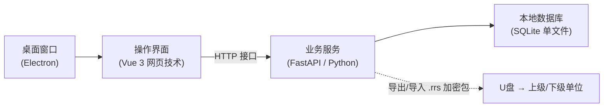
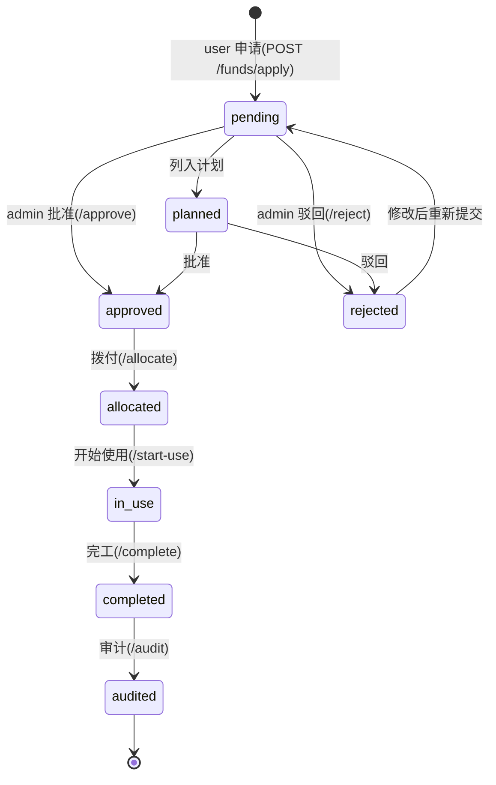
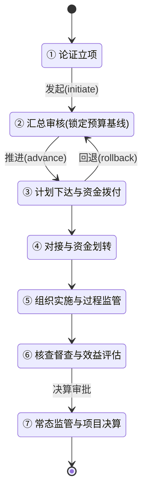
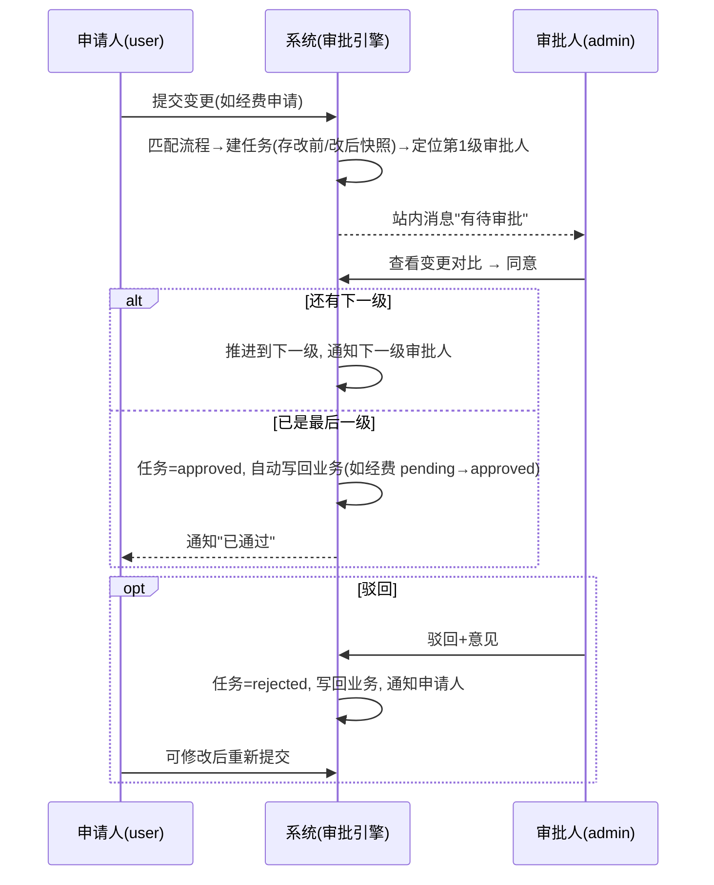
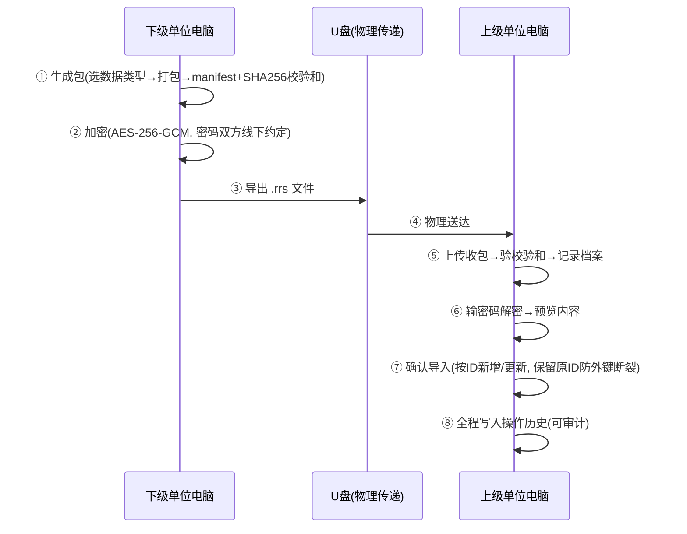
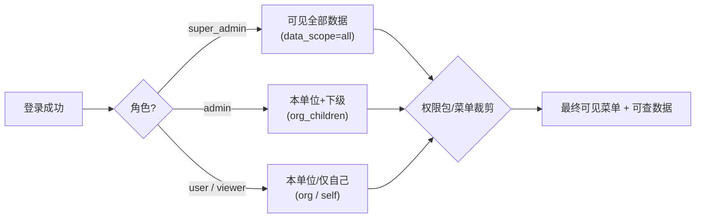

# 需求规格说明书(SRS)

> **版本**:v1.10.0  **更新日期**:2026-08-29
> **定位**:完整描述系统"为谁做什么、怎么运转、做到什么程度算合格"——即软件工程里的需求规格说明书(Software Requirements Specification)。
> **适用读者**:产品/验收人员、新接手的开发、想理解系统全貌的任何人。**零基础可读**:每个概念第一次出现都有白话解释。
> **阅读路线**:赶时间只读 §1~§3(是什么、给谁用、怎么运转);要验收/开发,再逐章对照 §4 功能需求与 §5 非功能需求。
> **配套文档**:数据结构见《[数据库设计总览](../08-数据设计/01-数据库设计总览.md)》/《[数据字典](../08-数据设计/02-数据字典.md)》;接口细节见《[API接口文档](../03-API文档/API接口文档.md)》;响应格式与命名契约见《前后端契约规范》。

---

## 1. 系统概述

### 1.1 一句话定位

> **一句话总结**:给军队帮扶干部用的**离线台账软件**——在一台不联网的电脑上,管理"帮扶了哪些村和学校、干了哪些项目、钱怎么花的、成效如何",并用**加密数据包(U 盘)**与上下级单位交换数据。

### 1.2 为什么是"离线单机"?

帮扶工作涉及军地数据,安全保密要求高,**不允许连接互联网**。因此:

- 系统装在单位内部的一台 Windows 电脑上,数据库就在本机(SQLite 文件),**断网照样全功能可用**;
- 与外部的数据交换只有一条通道:**导出加密包 → U 盘拷贝 → 对方导入**,全程可审计、可校验、可追责;
- 部分单位内部有隔离网络(如麒麟 V10 单机版),可部署为"本机网页服务"形态,但逻辑完全相同。

### 1.3 技术形态(一分钟版)

> 想深入技术架构(为什么选这些技术、分层怎么设计),读《[系统架构说明](../01-架构设计/系统架构说明.md)》。

### 1.4 与既有文档的关系

| 文档 | 分工 |
|------|------|
| **本 SRS** | 需求与流程的"总纲":谁用、干什么、流程怎么走、验收标准 |
| 系统完整需求规划文档.md | 早期精简版需求基线(保留作历史,细节以本 SRS 为准) |
| 数据库设计总览 / 数据字典 | "数据长什么样" |
| API 接口文档 / 前后端契约规范 | "接口怎么调、数据格式怎么约定" |
| 系统架构说明 / 系统设计图集 | "技术上怎么实现" |
| 02-用户手册 | 具体操作步骤(按页面) |

---

## 2. 用户与场景

### 2.1 四种角色

| 角色 | 是谁 | 主要干什么 | 不能干什么 |
|------|------|-----------|-----------|
| **super_admin** 超级管理员 | 系统管理员/装备保障人员 | 装机授权(录机器码、发通行码)、建组织与账号、配权限包、备份恢复、系统体检 | ——(全权) |
| **admin** 管理员 | 帮扶单位业务负责人 | 日常主角:录审村/校/项目台账、**审批**经费与变更、接收下级数据包、统计出报表 | 系统级运维(备份/授权)非必须 |
| **user** 普通用户 | 一线经办干部/驻村人员 | 填数据、**报经费**、记工作日志、生成上报包 | 审批、系统管理 |
| **viewer** 访客 | 领导/查阅人员 | 只读浏览:工作台、数据分析、地图、成效排名 | 一切写操作 |

### 2.2 多机协同里的两个特殊身份

系统可多台电脑协同(每台都是独立离线库),通过"上级—下级"注册机制组网:

- **上级单位管理员**:登记下级实例(绑机器码)、给下级发通行码、下发管控配置包(规定下级能用哪些模块)、**接收并审核**下级上报的数据包;
- **下级单位用户**:用上级发的通行码注册账号,按上级下发的配置填报,定期生成上报包交上级。

### 2.3 基层干部的一天(user 角色)

> 老王是驻村经办。早上开机登录(账号绑定了这台电脑的机器码,别的电脑登不上);先看待办——昨天报的 3 万元经费申请"管理员已批准";上午把本月的村里人口数据补录进"帮扶村管理"的年度表;下午把季度帮扶成果打包(一键生成 .rrs 加密包),设好和上级约好的密码,拷进 U 盘;下班前顺手把今天走访贫困户的情况写进工作日志。全程没碰网线。

---

## 3. 核心业务流程(图解)

> 本节是全系统的"骨架"。每条流程 = 白话故事 + 图 + 关键规则表。

### 3.1 流程一:经费生命周期(最核心)

**白话故事**:小张要给村里买 5000 元化肥,在"经费申请"里填报交给管理员;管理员王主任在"审批管理"里看到这条申请,批准;钱实际拨下来后标记"已拨付";村里开始花钱,记账"使用中";活干完点"完工";年底审计员查账通过,这笔钱的状态定格为"已审计",从此不能再动。

**关键规则**:

| 规则 | 说明 |
|------|------|
| 状态只能按图走 | 流转白名单写死在代码里,不能跳步(如"待审"不能直接"使用中") |
| 每次流转留痕 | 每次变化写一条 `fund_status_history`(谁/从什么状态/到什么状态/原因) |
| 审批联动 | 申请即自动生成审批任务;**审批通过/驳回会自动把经费状态改掉**;写回失败任务标记 `approved_apply_failed` 可重试 |
| 金额三件套 | 总额/已用/剩余,使用中随时对账;钱花超了系统自动记"超支异常" |
| 军地来源 | `source` 区分 military/government/donation/enterprise,体现军地共同投入 |

### 3.2 流程二:项目资金七阶段(管理视角)

经费状态机管"一笔钱";七阶段管"一个项目的钱从论证到决算的全程推进"。两套并行:每笔经费有 `lifecycle_phase` 标注处于哪个阶段。

**各阶段配套动作**:

| 阶段 | 系统里干什么 |
|------|-------------|
| ② 汇总审核 | **预算基线锁定**(BudgetBaseline 快照)——之后预算改动全留痕,偏差率可算 |
| ③ 计划下达 | 生成**拨款指令**(可一笔拆给多个下级单位) |
| ④ 资金划转 | 开**划转凭证**(军→地 / 地→军 双向,draft→submitted→confirmed) |
| ⑤ 过程监管 | 使用台账记账;**异常自动检测**:超支/偏差/闲置/重复/缺凭证 5 类 × 3 级(提示/警告/危险) |
| ⑥ 核查评估 | 效益评估、成效排名 |
| ⑦ 决算 | 决算报告(draft→submitted→approved)、绩效评级 A/B/C/D、**资产核验**(销号前置) |

### 3.3 流程三:审批流水线(变更怎么签批)

**白话故事**:系统像一个"签批流转箱"。谁要改重要数据(如经费申请、学校信息变更),系统自动把"改前/改后快照"装进一个任务袋投进去;配置好的审批人逐级签字;全部签完,系统**自动把结果写回**业务数据;任何人任何时候都看得到每一级谁签的、签了什么意见。

**关键规则**:

| 规则 | 说明 |
|------|------|
| 流程可配置 | 按模块(经费/学校/项目…)配置,最多 **5 级**;每级可指定"某个人"或"某个角色" |
| 单机快速通道 | 单位里常常一人兼申请和审批,系统提供"提交即自动通过 / 一键审批全部"快捷方式 |
| 写回不丢 | 审批通过但写回业务失败 → 任务标 `approved_apply_failed`,可人工重试,不会"批了没生效" |
| 全程留痕 | 每级签字(同意/驳回/转交)都有记录;转交时记"转给谁" |
| 权限 | "审批管理"菜单仅 admin/super_admin 可见;user 在"我的申请"看进度 |

### 3.4 流程四:数据包交换(两台电脑怎么传数据)

**白话故事**:上级和下级各有一台不联网的电脑,数据怎么同步?像寄挂号信:下级把要报的数据装进"包裹"(数据包),贴上**防拆封章**(SHA256 校验和),再用和上级约好的密码上锁(AES-256 加密);拷到 U 盘送去;上级收包后先验"封章"没被动过,用密码开锁,**先预览**里面是什么,确认无误才入账(导入)。全程每一步都记在"收发登记簿"(操作历史)里。

**关键规则**:

| 规则 | 说明 |
|------|------|
| 两种包 | `task` 任务包(上级→下级,发任务)/ `report` 上报包(下级→上级,交成果) |
| 包 ≠ 上报单 | 包是"文件";上报单(DataReport:draft→submitted→approved/rejected)是围绕包的一次"报送—签收—审批"业务记录 |
| 增量同步 | 每行数据带 `sync_version`(改动+1);只传"比上次新的",避免反复拷整库 |
| 冲突处理 | 两边都改过同一条 → 记入冲突清单,可选 保留本地/用导入/合并/跳过 |
| 保留原 ID | 导入按原编号写入,保证"项目-经费"等引用关系不断裂 |

### 3.5 流程五:多机协同组网(授权与管控)

**白话故事**:上级怎么知道"下级那台电脑"是自己人?三步:①装机时记录那台电脑的**硬件指纹**(机器码);②上级给下级发一个**通行码**(类似邀请码),下级用它注册账号、激活授权;③上级下发**管控配置包**,规定下级"能用哪些模块、要报哪些数据"。之后收发数据包就形成闭环。

### 3.6 流程六:登录与权限判定(为什么他看不到那个菜单)

**白话故事**:登录成功只拿到"身份";系统按三层决定你能看到/能改什么:**第一层角色**决定默认界面(管理员有"审批管理",普通用户没有);**第二层数据范围(data_scope)** 决定你能看到哪个单位的数据(本单位?含下级?全部?);**第三层细粒度授权**(权限包/菜单裁剪)微调个别功能。所有查询都由系统自动按第二层过滤——**越权数据你连查都查不到**,而不只是"显示为灰色"。

| data_scope 取值 | 能看到的数据 |
|-----------------|-------------|
| all | 全部单位(仅 super_admin) |
| org_children | 本单位及其下级单位 |
| org | 仅本单位 |
| self | 仅自己创建的记录 |

**登录安全**:密码错误连续多次锁定账号;账号可绑定机器码(换电脑登不上);登出/改密后所有旧登录立即失效(token_version);可选动态口令双因素(2FA)。

---

## 4. 功能需求

> 编号规则:`FR-<域>-NN`。每条含【谁 + 能做什么 + 怎么算合格】。页面锚点 = 用户在菜单里找到它的位置;接口锚点 = 后端 URL 前缀(细节见 API 接口文档)。

### FR-1 帮扶村管理(核心台账)

| 编号 | 需求 | 验收标准 | 锚点 |
|------|------|---------|------|
| FR-1-01 | 登记帮扶村(名称/地理坐标/帮扶单位/过渡期状态)及 12 类区域标记(三区三州/重点县/民族地区等) | 保存后列表可查;地图落图位置与坐标一致 | 菜单"帮扶村管理";`/supported-villages` |
| FR-1-02 | 按年度维护 10 个板块数据(人口/收入/部队投入/产业/基建/党建/医疗/消费/就业/教育)+ 村委会及成员 | 同一村同一年度每板块只有一版(重复保存为更新);跨年数据互不覆盖 | 同上,详情页分板块 |
| FR-1-03 | 删除为软删除,可在回收站恢复;详情保留已删记录供审计 | 删除后列表不可见但详情/回收站可见;恢复后回到列表 | 回收站 |
| FR-1-04 | 导出村数据为 Excel(全量与预览) | 导出文件可打开且字段完整 | `/supported-villages/export` |
| FR-1-05 | 数据隔离:任何查询只返回登录人数据范围内的村 | A 单位账号搜不到 B 单位的村(直接查接口也返回空) | 全部端点 |

### FR-2 帮扶学校管理

| 编号 | 需求 | 验收标准 | 锚点 |
|------|------|---------|------|
| FR-2-01 | 登记学校(类型/师生数/帮扶单位/帮扶起止/状态),独立于村 | 保存后列表可查,支持按状态筛选 | 菜单"帮扶学校管理";`/schools` |
| FR-2-02 | 记录帮扶资金流水、学校帮扶项目、受资助学生(资助状态:待批/已批/已发放/完成) | 三类明细可从学校详情直达并增改 | 详情页 |
| FR-2-03 | 学校变更走审批流水线(可配置) | 提交后"审批管理"出现任务;通过后数据生效 | `/approval` |

### FR-3 帮扶项目管理

| 编号 | 需求 | 验收标准 | 锚点 |
|------|------|---------|------|
| FR-3-01 | 项目全生命周期:立项(挂帮扶村)→状态流转(草稿/待审/已批/进行中/完成/取消)→进度/预算/实际花费 | 状态流转受白名单约束,非法跳转被拒 | 菜单"帮扶项目管理";`/projects` |
| FR-3-02 | 记录项目任务、里程碑(含超期标记)、按阶段附件、变更留痕 | 里程碑超期自动标红;变更历史可回看 | 详情页 |
| FR-3-03 | 拨款方/收款方完整账户信息登记 | 详情页可见并可编辑 | 详情页 |
| FR-3-04 | 项目里程碑管理与推进 | 里程碑列表可排序、可标记完成 | `/projects` + milestones |

### FR-4 经费管理(含生命周期)

| 编号 | 需求 | 验收标准 | 锚点 |
|------|------|---------|------|
| FR-4-01 | 经费台账 CRUD,三选一挂靠(项目/村/校),区分军地来源 | 保存后列表可按状态/来源/年度筛选 | 菜单"经费管理";`/funds` |
| FR-4-02 | 普通用户**经费申请**简化入口 | user 无需管理员权限即可提交申请;提交后自动生成审批任务 | 菜单"经费申请";`/funds/apply` |
| FR-4-03 | 八状态生命周期流转与留痕(§3.1) | 每次流转写状态史;轨迹页可回放全流程 | `/funds/{id}/history/status` |
| FR-4-04 | 使用台账记账(每笔支出,可挂预算科目),超支自动告警 | 台账合计与"已用金额"一致;超支生成 danger 级异常 | 经费详情-台账 |
| FR-4-05 | 附件管理(合同/发票/凭据/报告分类) | 上传/下载/删除均写操作日志 | 经费详情-附件 |
| FR-4-06 | 年度预算编制与执行(村级预算,8 科目,80%/90%/100% 预警) | 花费达阈值自动生成提醒 | 菜单"经费管理-预算";`/fund-budgets` |
| FR-4-07 | **七阶段推进看板**(§3.2):发起/推进/回退、预算基线锁定、划转凭证(军地双向)、合规检查 | 阶段推进受顺序约束;基线锁定后偏差率可算 | 菜单"资金周期";`/fund-lifecycle` |
| FR-4-08 | 异常检测与处理(5 类×3 级) | 异常清单可筛选、可标记处理 | 菜单"资金周期-异常";`/fund-lifecycle/anomalies` |
| FR-4-09 | 决算与绩效(草稿→提交→批准;A/B/C/D 评级;资产核验前置) | 资产核验未通过不能销号 | 菜单"决算结算";`/fund-lifecycle/settlements` |
| FR-4-10 | 拨款指令(一笔指标拆给多个下级单位并跟踪签收) | 明细状态可独立流转(待拨/已划/已确认) | `/fund-lifecycle` 拨款指令 |

### FR-5 审批管理

| 编号 | 需求 | 验收标准 | 锚点 |
|------|------|---------|------|
| FR-5-01 | 多级审批流水线(≤5 级,按人/按角色,可配置流程) | 配置后新变更按流程逐级流转 | 菜单"审批管理";`/approval` |
| FR-5-02 | 同意/驳回/转交/撤回/重新提交/催办;变更前后对比视图 | 每个动作有留痕;对比页逐字段高亮差异 | 审批任务详情 |
| FR-5-03 | 通过后自动写回业务数据,失败可重试 | 出现 `approved_apply_failed` 任务时可手动重试成功 | `/approval/tasks/{id}/retry-apply` |
| FR-5-04 | 单机快速通道:提交即通过/单条快审/一键审批全部 | 三种方式均产生完整审批记录 | `/approval/submit-auto` 等 |
| FR-5-05 | 审批通过/驳回自动通知申请人 | 申请人站内消息可见 | 消息 |

### FR-6 数据上报与多机协同

| 编号 | 需求 | 验收标准 | 锚点 |
|------|------|---------|------|
| FR-6-01 | 一键生成上报包(全部数据类型)或自选类型打包 | 包含 manifest 清单与 SHA256 校验和 | 菜单"数据上报";`/data-packages` |
| FR-6-02 | AES-256-GCM 加密导出 .rrs(密码线下约定) | 错误密码无法解密;包档案记录算法/盐/迭代 | `/data-packages/export-encrypted` |
| FR-6-03 | 接收包:验校验和→解密预览→确认导入(保留原 ID) | 校验失败拒收;预览与导入结果一致;导入产生冲突时可选择策略 | 菜单"接收数据包";`/data-packages/upload-encrypted` |
| FR-6-04 | 增量同步包(只传变更数据) | 二次导出的包只含 sync_version 变化的行 | `/data-packages/incremental/*` |
| FR-6-05 | 上报单工作流(草稿→提交→审批/驳回,关联包) | 状态流转完整留痕;驳回可重新提交 | `/data-reports` |
| FR-6-06 | 包版本管理与版本对比 | 可列出历史版本并对比两版差异 | 菜单"数据包列表-版本管理" |
| FR-6-07 | 下级实例注册/授权/在线状态管理;通行码签发与校验;管控配置包下发 | 下级用通行码可注册账号;未授权实例不能导入 | 菜单"系统管理-机器码/通行码";`/subordinates`、`/control-packages` |
| FR-6-08 | 同步冲突清单与解决(保留本地/用导入/合并/跳过) | 冲突逐条可处理并留痕 | `/data-sync` |

### FR-7 数据质量与导入导出

| 编号 | 需求 | 验收标准 | 锚点 |
|------|------|---------|------|
| FR-7-01 | Excel 批量导入(增量/全量两种模式)+ 导入历史 | 模板不匹配给出明确报错;历史记录成功/失败行数 | 菜单"帮扶数据管理-数据批量导入";`/import` |
| FR-7-02 | 校验规则引擎(11 种规则 × 5 个模块),录入/导入前把关 | 不满足必填/范围/格式等规则的数据被拦截并逐行提示 | 菜单"帮扶数据管理-校验规则";`/validation` |
| FR-7-03 | 数据质量评分与问题清单 | 低质量数据生成待办清单 | `/data-quality` |
| FR-7-04 | 异步导出(大文件后台生成+过期清理)、分片上传 | 大数据量导出不阻塞界面;任务列表可见进度 | `/export`、`/import/chunked` |
| FR-7-05 | 报表模板管理与自定义导出 | 按模板字段映射导出 Excel | 菜单"报表模板管理";`/report-templates` |
| FR-7-06 | 批量操作(跨模块批量修改/删除,带审批) | 批量删除进入回收站 | `/batch` |
| FR-7-07 | 回收站:软删数据保留、恢复、到期清理 | 恢复后数据回到原列表 | 回收站页面 |

### FR-8 分析展示

| 编号 | 需求 | 验收标准 | 锚点 |
|------|------|---------|------|
| FR-8-01 | 工作台:统计卡/KPI 趋势/年度趋势/最近动态 | 数字与台账一致 | 菜单"工作台";`/dashboard` |
| FR-8-02 | 多维统计与数据分析(村/人口/收入/经费) | 图表可按年度/区域/单位切分 | 菜单"数据分析";`/analytics` |
| FR-8-03 | 地图可视化(村庄落图,离线瓦片)+ 地图瓦片管理 | 断网可加载地图 | 菜单"数据分析-地图可视化";`/map` |
| FR-8-04 | 成效评估与排名(村际对比,A/B/C/D) | 评估结果影响排名页 | 菜单"成效排名/成效评估";`/effectiveness` |
| FR-8-05 | 大屏展示模式 | 全屏轮播关键指标 | 菜单 bigscreen |
| FR-8-06 | AI 智能分析(数据解读/辅助报告) | 断网时功能不可用但界面不崩(降级) | `/ai` |

### FR-9 系统与安全

| 编号 | 需求 | 验收标准 | 锚点 |
|------|------|---------|------|
| FR-9-01 | 登录 + JWT 会话;密码策略(长度/复杂度);连续失败锁定 | 弱密码被拒;连错 N 次锁定账号 | `/auth/login` |
| FR-9-02 | 机器码绑定登录(可选强制);通行码注册账号;机器码吊销 | 未授权机器无法登录绑定账号 | 菜单"系统管理-机器码/通行码管理";`/machine-code` |
| FR-9-03 | 账号与组织管理、数据范围四档、菜单裁剪、权限包 | 各角色登录后菜单符合 §3.6 规则 | 菜单"用户权限管理";`/users`、`/menus` |
| FR-9-04 | 细粒度 RBAC(角色/权限/资源 ACL/访问日志) | 未授权操作返回 403 并留痕 | `/rbac` |
| FR-9-05 | 审计五类留痕(操作/登录/API 访问/导出/安全事件),双写文件+库 | 任意关键操作在审计页可查;数据库直查与文件一致 | 菜单"审计日志";`/audit` |
| FR-9-06 | 备份:手动/计划、加密备份、完整性校验、预览、恢复、U 盘目标检测、上传恢复 | 恢复后系统数据与备份点一致;损坏包被拒绝且不破坏现库 | 菜单"备份管理";`/system/backup` |
| FR-9-07 | 零信任评估(会话信任分/访问策略/安全事件) | 高风险会话被标记并可查询 | 菜单"零信任安全";`/zero-trust` |
| FR-9-08 | 敏感字段加密存储 + 密钥托管轮换 + 数据分级 | 库文件中敏感字段为密文 | `/encryption`、`/secrets`、`/data-tier` |
| FR-9-09 | 系统体检/健康监控/指标/后台任务/错误报告/更新日志/国际化/帮助 | 体检报告能发现常见问题(磁盘/数据库完整性) | 菜单"系统管理"各组 |
| FR-9-10 | 消息/提醒/待办三件套;全局搜索;用户反馈 | 审批等事件产生站内消息与待办 | 菜单"待办事项"等 |
| FR-9-11 | 离线兜底:后端不可用时前端提供模拟数据模式,界面不白屏 | 断开后端界面仍可浏览(有明确"离线演示"提示) | 前端 offlineMock |

## 5. 非功能需求(NFR)

> 完整性能指标见《[性能需求](../05-性能优化/性能需求.md)》;安全红线见《[CONTEXT.md 安全不变量](../../../CONTEXT.md)》与《[数据隔离审计矩阵](../../数据隔离审计矩阵.md)》——此处只汇总,不重复。

| 类别 | 要求(摘要) | 详见 |
|------|-------------|------|
| **性能** | 常规列表接口 < 500ms;万级行分页流畅;备份/导出异步化不阻塞界面;SQLite WAL 模式支撑多读单写 | 性能需求.md |
| **安全** | 数据隔离(漏过滤=最高级缺陷)、fail-closed、错误细节不出站、敏感字段加密、审计双写、限流(登录 5 次/分等)、密码策略、CSRF 双提交 Cookie | CONTEXT.md 六不变量;安全加固.md |
| **可靠性** | 断网全功能可用;备份可校验可恢复(损坏包 fail-closed);恢复后一致性自检;软删除防误删 | §3.4;FR-9-06 |
| **可审计** | 一切关键操作可追溯到"人+时间+改前改后";审计记录不可静默绕过 | FR-9-05 |
| **可部署** | Windows 离线安装包(Electron+PyInstaller,零依赖);麒麟 V10 ARM64 单机版;目标机器无需装任何运行环境 | 04-部署文档 |
| **可维护** | 后端测试 1.2 万+ 全绿是合入门禁;覆盖率 98% 门禁;CI 静态扫描(flake8/bandit/菜单对齐/软删过滤) | AGENTS.md 质量门禁 |

## 6. 术语表(小白版)

| 术语 | 白话解释 | 类比 |
|------|---------|------|
| **帮扶村(SupportedVillage)** | 一对"帮扶单位 + 村"的结对档案,系统最核心的业务对象 | 结对帮扶的"户口本" |
| **自然村(villages)** | 纯地理/产业基础信息的村字典,与帮扶村**互不关联** | 地图上的村子 vs 帮扶台账上的村子 |
| **经费(Fund)** | 一笔帮扶钱的档案,带 8 状态生命周期 | 钱的" journey 卡片" |
| **七阶段(LifecyclePhase)** | 项目资金从论证立项到决算的 7 步管理框架 | 钱的一生分 7 章故事 |
| **数据包(DataPackage)** | 两台电脑之间传数据的加密压缩文件(.rrs) | 挂号信+防拆封章+密码锁 |
| **上报单(DataReport)** | 围绕数据包的"报送—签收—审批"业务记录 | 快递的运单 |
| **增量同步** | 只传"上次之后改过的"数据(sync_version 版本号识别) | 只寄新信,不重寄全部旧信 |
| **审批任务(ApprovalTask)** | 一次待签批的变更,附改前/改后快照 | 待签字的文件夹 |
| **权限包(PermissionPack)** | 预先打包的一组菜单,给同类人员一键套用 | 套餐 |
| **机器码** | 电脑硬件指纹(wmic+MAC+主机名),离线授权的锚点 | 电脑的指纹 |
| **通行码(pass_code)** | 上级签发的注册/激活凭证,线下告知 | 离线世界的邀请码 |
| **管控配置包** | 上级规定下级"能用哪些模块、报哪些数据"的配置文件 | 规章制度包 |
| **数据范围(data_scope)** | 用户能看到多大范围的数据:all/org/org_children/self | 视野圈 |
| **软删除** | 删除=打标记(is_active=False),数据还在,可恢复可审计 | 回收站 |
| **envelope(响应包裹)** | 接口统一返回 `{code, data, message}` 格式 | 快递的统一包装箱 |
| **sync_version** | 每行数据的改动版本号,增量同步的依据 | 房间门上的变更计数牌 |
| **审计双写** | 审计日志同时写文件(app.log)和数据库(可查表) | 一式两份存档 |
| **loopback 门禁** | 某些敏感接口只允许本机(127.0.0.1)调用 | 只给"家里人来开门" |

---

*文档结束。发现描述与实际行为不符?以代码为准,并请更新本文档。*

