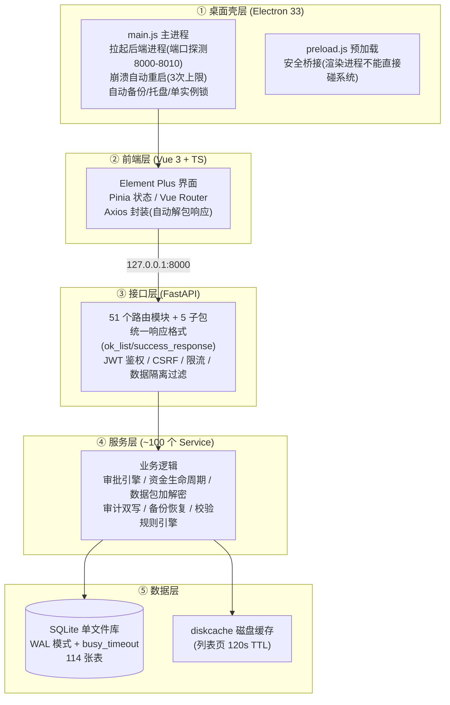

# 帮扶管理信息系统 - 系统架构说明

> **版本**:v1.10.0  **更新日期**:2026-08-29(全文重写,纠正历史错误)
> **定位**:用白话讲清系统"技术上是怎么搭起来的、为什么这么搭、关键机制怎么工作"。
> **适用读者**:新加入的开发者、运维部署人员、想知其所以然的任何人。
> **图与文的关系**:[系统设计图集](系统设计图集.md) 里有 15 张图(架构/部署/数据流/状态机),本文负责"讲人话";两文互补。
> ⚠️ 历史版本曾写有"PostgreSQL 主从/Electron 28/Python 3.9+",均为过期信息——本系统**纯 SQLite 离线单机**,现版 Electron 33 / Python 3.11,请以本文为准。

---

## 1. 一句话总结

> **一句话总结**:一台不联网的 Windows 电脑上,Electron 桌面窗口里装着 Vue3 网页界面,界面通过本机 HTTP 接口(FastAPI)读写同一个文件数据库(SQLite);数据不出电脑,跨电脑只走"加密数据包 + U 盘"。

## 2. 总体架构(自上而下五层)



**各层一句话**:

| 层 | 干什么 | 关键约定 |
|----|--------|---------|
| ① Electron 壳 | 当"浏览器 + 守护进程"用:开窗口、启动/重启后端、开机自动备份 | 后端崩溃自动拉起,最多 3 次;VC++ 运行库随安装包 |
| ② 前端 | 全部用户界面;离线时启用内置模拟数据兜底 | 响应拦截器自动把 `{code,data,message}` 解包,业务代码直接拿数据 |
| ③ 接口层 | 所有 HTTP 接口;鉴权、限流、隔离过滤都在这一层横切 | 新端点必须:envelope 响应 + `filter_by_data_scope` + 软删过滤 |
| ④ 服务层 | 真正的业务规则(状态机/审批/加密/备份) | `safe_commit()` 提交(自动回滚);写操作必调 `write_work_log()` |
| ⑤ 数据层 | 一个 SQLite 文件 = 整个数据库 | WAL 模式(读写不互斥)+ `busy_timeout=10s` |

## 3. 为什么这么选型(给决策者/新人的理由)

| 选择 | 理由 |
|------|------|
| **桌面单机而非网页系统** | 军地帮扶数据涉密,不允许上互联网;部署目标机器常年离线 |
| **SQLite 而非 MySQL/PostgreSQL** | 单文件零安装零运维,备份=拷文件,完全满足单机规模;配 WAL 后读写并发足够 |
| **Electron 而非原生 GUI** | 界面用成熟的网页技术栈(Vue3),开发快、跨 Windows/麒麟两平台复用 |
| **FastAPI 而非 Flask/Django** | 自动接口文档(开发模式)、类型校验(Pydantic)、异步支持,适合前后端分离 |
| **加密数据包而非网络同步** | 不需要联网基础设施;包有校验和+密码,可控可审计;失败不产生"半同步"状态 |

## 4. 五个关键机制(系统如何保证正确性)

### 4.1 统一响应格式(前后端的"普通话")

所有接口返回 `{code:200, data:{...}, message:"成功", success:true}`(列表在 data 里带 items/total/page/page_size)。前端拦截器自动把 `data` 里的字段展开到顶层,业务代码不用到处 `.data.data`。**新端点必须用 `ok_list()`/`success_response()` 帮助函数**,禁止裸字典——详细契约见《前后端契约规范》。

### 4.2 数据隔离(每条数据都知道"属于哪个单位")

几乎每张业务表带 `organization_id` + `created_by`;接口层统一调用 `filter_by_data_scope(query, model, user)`,按登录人的 `data_scope`(all/org/org_children/self)自动加过滤条件。**漏加过滤 = 跨单位数据泄露 = 军用审计不通过**(CI 有静态扫描把关)。

### 4.3 软删除(删除≠消失)

删除业务数据是把 `is_active` 置 False(旧五大家族)或 `is_deleted=True`(新模型),行保留在库里:列表自动过滤、详情/回收站可查、可恢复、可审计。**跨组织访问返回 403 而非 404**——区分"存在但不是你的"与"不存在"。

### 4.4 审计双写(一式两份)

`AuditLogger.log()` 同一个动作写两处:app.log 文件(可归档)+ 数据库表(可查询可导出)。写操作同时调 `write_work_log()` 记业务工作日志。军用审计要求"任何操作可追溯到人+时间+改前改后"。

### 4.5 sync_version 增量同步

每行数据带版本号,SQLAlchemy 的 UPDATE 事件监听器自动 +1。导出增量包 = 只挑"版本号比上次同步点新"的行。**因此任何绕过 ORM 的手写 UPDATE 都会造成该行永远不同步**——改数据请务必走模型层。

## 5. 运行与部署形态

| 形态 | 说明 | 适用 |
|------|------|------|
| **开发模式** | `cd backend && python start.py`(8000 端口)+ `cd frontend && npm run dev`(5173 端口),前后端热更新 | 开发调试 |
| **Windows 离线安装包** | PyInstaller 把后端打成 `assistance-backend.exe`(自带 Python 环境)→ electron-builder 打 NSIS 安装包;目标机器零依赖 | 军内终端交付 |
| **麒麟 V10 ARM64 单机版** | 无 Electron,Docker 交叉编译出 DEB:后端 + 前端静态文件,系统浏览器访问 | 国产化机器 |
| **多机协同** | 各机独立安装独立库,按《需求规格说明书》§3.5 组网(机器码注册→通行码→管控包→数据包) | 上下级单位 |

**打包链路**:`npm run build`(前端产物)→ 同步到 `resources/frontend/` → `PyInstaller assistance-backend.spec`(后端,含 reportlab 等隐式依赖)→ `npx electron-builder --win --x64`。详见《[构建打包指南](../../04-部署文档/01-Windows部署/构建打包指南.md)》。

## 6. 目录导览(详细版见根目录《项目文件结构说明.md》)

```
backend/
  app/
    api/v1/        47 个业务路由模块 + auth/data/import_export/monitoring/system 5 子包(接口层)
    services/      ~100 个服务(业务层:审批/资金/数据包/审计/备份…)
    models/        58 文件 114 张表(SQLAlchemy 模型)
    core/          横切设施:security(JWT/限流)/ database / response /
                   transaction(safe_commit)/ config / cache
    alembic/       数据库迁移(基线:012_consolidate_baseline)
  tests/           1 万+ 测试(覆盖率门禁 100%：.coveragerc fail_under，可覆盖集口径)
frontend/
  src/views/       131 个页面(按业务域分目录)
  src/api/         接口封装(统一走 @/api/request)
  src/stores/      Pinia 状态
electron/          main.js(主进程)/ preload.js(安全桥)
docs/              文档中心(本文件所在)
```

## 7. 横切机制速查(改代码前必知的"交规")

| 机制 | 要点 | 详细 |
|------|------|------|
| 提交纪律 | 一律 `safe_commit(db)`(失败自动回滚并抛出),禁止裸 `db.commit()` | `app/core/transaction.py` |
| 限流 | 登录 5 次/分、注册 3 次/分、刷新 10 次/分、CSRF 30 次/分(fail-closed) | `app/core/security.py` |
| CSRF | Double Submit Cookie,前端自动带 X-CSRF-Token | 契约规范 |
| 缓存 | 列表页缓存 120s;**写操作必须失效对应缓存**(school/village 均已接入) | `app/core/cache.py` |
| 密码 | 策略校验(12位+大小写+数字+特殊字符);bcrypt 哈希 | `PasswordPolicy` |
| 令牌 | access token 带 jti;登出递增 token_version + 黑名单;refresh 走 token_manager | `app/core/token_manager.py` |
| loopback 门禁 | 机器码校验/密码重置/权限包导入确认等敏感接口仅限本机调用(读 socket 对端,不信 X-Forwarded-For) | 各模块 `_client_is_loopback` |
| 错误细节不出站 | 接口 detail 禁止内插异常文本;CI 扫描测试把关(`test_no_error_detail_leak.py`) | W1-T8 |

## 8. 相关文档

- 图: [系统设计图集](系统设计图集.md)(15 张 Mermaid 图)
- 业务: [需求规格说明书](../00-需求规格说明书/01-需求规格说明书.md)
- 数据: [数据库设计总览](../08-数据设计/01-数据库设计总览.md) / [数据字典](../08-数据设计/02-数据字典.md)
- 接口: [API接口文档](../03-API文档/API接口文档.md) / [前后端契约规范](../前后端契约规范.md)
- 部署: [04-部署文档](../../04-部署文档/README.md)
