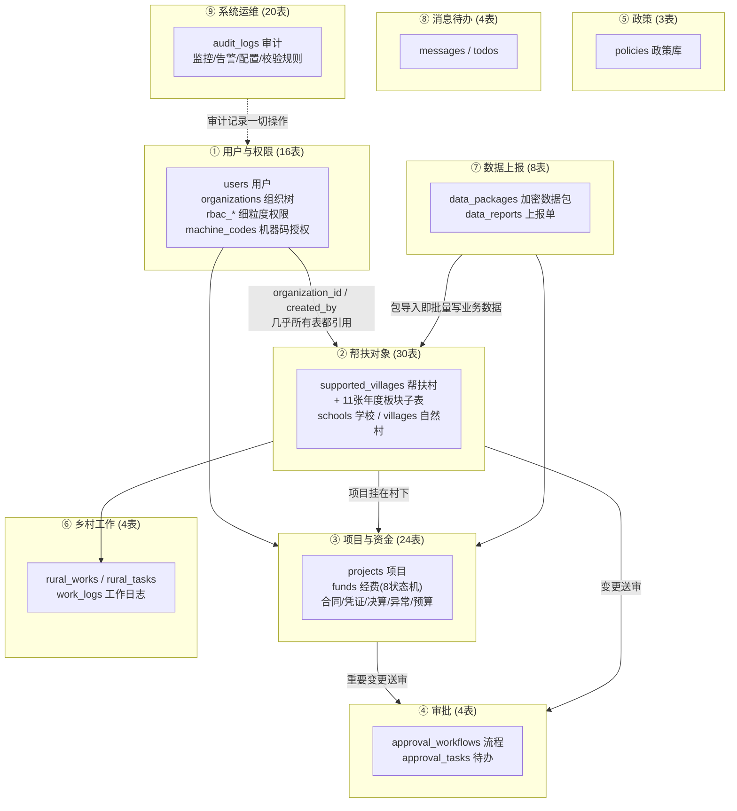
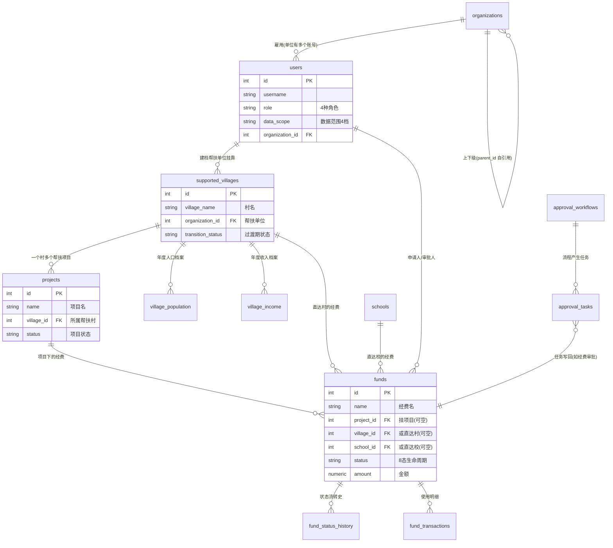
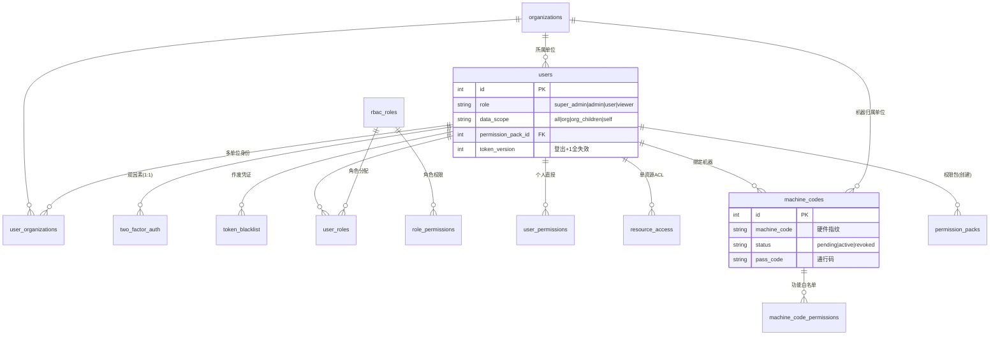
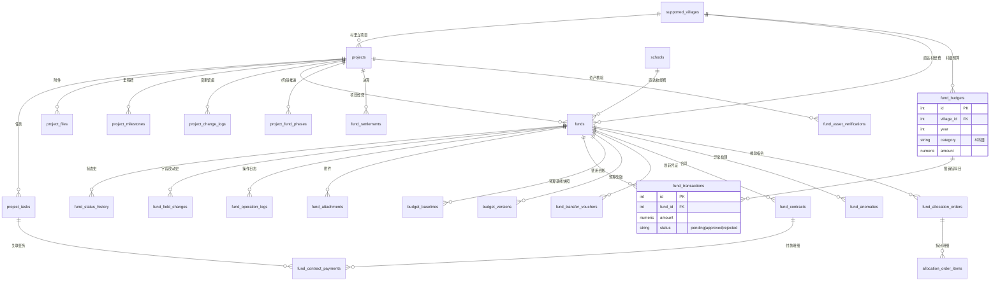
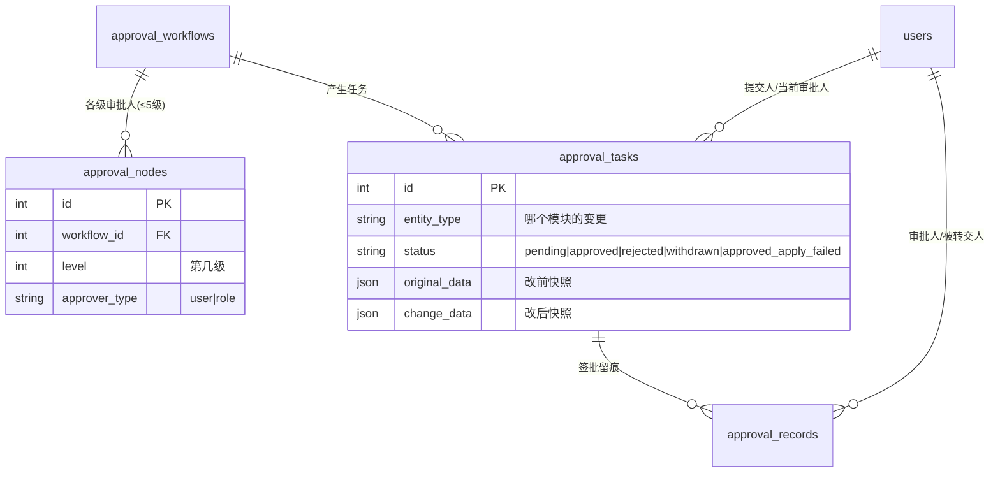
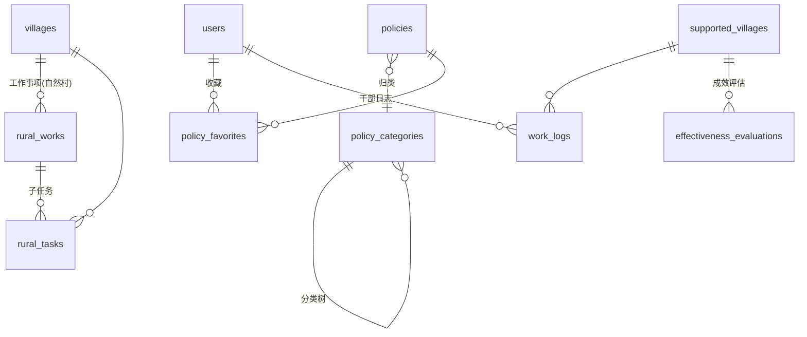
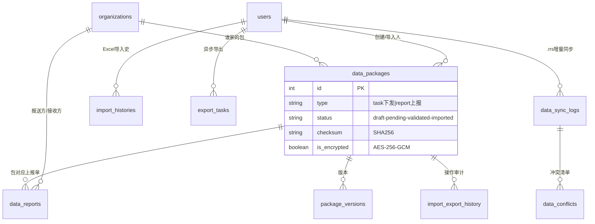
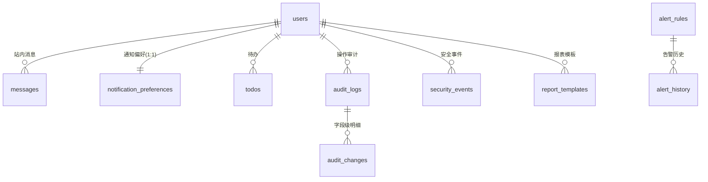

# 数据库设计总览

> **版本**:v1.10.0  **更新日期**:2026-08-29
> **定位**:用"图"看懂数据库——全库 9 大业务域的关系鸟瞰 + 每个域的实体关系图(ER 图)+ 核心业务实体精讲。
> **适用读者**:想理解"数据是怎么组织的"的任何人。先读本文建立整体图景,再按需查阅《02-数据字典》逐表细节。
> **图示说明**:所有图都是 **Mermaid** 画法。看图诀窍:方框 = 表/实体;连线上的记号 `||--o{` 读作"一(‖)对多(o{)";如 `users ||--o{ funds` = 一个用户可以有多条经费。

---

## 0. 一句话总结

> 整个数据库围绕 5 个"主角"展开:**用户(User)** 在 **组织(Organization)** 里工作,结对帮扶 **村庄(SupportedVillage)** 和 **学校(School)**,开展 **项目(Project)**、管理 **经费(Fund)**;所有重要变更走 **审批**,单位之间靠 **数据包** 交换数据;其余 100 多张表都是这 7 类主角的"档案明细"。

## 1. 全域鸟瞰图

**怎么看这张图**:9 个大格子是 9 个业务域,箭头表示"域之间谁引用谁"。`用户与权限` 是地基(所有域都引用它),`帮扶对象` 和 `项目资金` 是业务主干,`数据上报` 是连接多台电脑的桥梁。

## 2. 核心业务实体精讲(先看这张!)

**这 7 个实体撑起系统主干**,理解它们之间的关系,其他表都只是"它们的明细档案":

**白话故事**:帮扶单位(organizations 里的一个节点)的干部(users)给结对村(supported_villages)建档,每年填人口、收入等"体检表"(village_population 等 11 张子表);村里要修路,就立一个项目(projects),项目要花钱就申请经费(funds)——经费可以是这个项目的,也可以不经过项目直接给村/校;钱每"走一步"(申请→批准→拨付→使用→完工→审计)都在 fund_status_history 里留一条记录,而审批环节由审批流水线(approval_*)驱动。

## 3. 分域 ER 图

### 3.1 用户与权限域(16 表)

**怎么看**:左半是"账号与组织",右半是"细粒度权限(rbac_*,UUID 主键)"和"离线授权(机器码)"。`user_organizations` 是一张纯粹的"配对表"(多对多中间表)。

> **权限生效优先级**(记住这个就够):用户自定义菜单(allowed_menus)> 权限包(permission_packs)> 角色默认菜单。细粒度操作允许与否:用户直授 > 角色权限 > 拒绝。

### 3.2 帮扶对象域(30 表)

**怎么看**:中心是帮扶村;11 张年度子表结构完全同构(村+年唯一),图中合并画为"年度板块×11";右侧是与帮扶村**互不关联**的自然村家族(⚠️ 常见误解);下方是独立的学校线。

```mermaid
erDiagram
    supported_villages ||--o{ village_population : "年度人口"
    supported_villages ||--o{ village_income : "年度收入"
    supported_villages ||--o{ force_investment : "部队投入"
    supported_villages ||--o{ industry_support : "产业"
    supported_villages ||--o{ infrastructure_improvement : "基建"
    supported_villages ||--o{ party_building_support : "党建"
    supported_villages ||--o{ medical_support : "医疗"
    supported_villages ||--o{ consumption_support : "消费"
    supported_villages ||--o{ employment_support : "就业"
    supported_villages ||--o{ education_support : "教育"
    supported_villages ||--o{ support_funding : "过渡经费"
    supported_villages ||--o{ village_committee_info : "村委会"
    village_committee_info ||--o{ village_committee_members : "成员"
    supported_villages ||--o{ village_attachments : "附件"
    supported_villages ||--o{ annual_income : "新版年度统计×4"
    villages ||--o{ villagers : "村民"
    villages ||--o{ industries : "产业"
    villages ||--o{ tea_plantations : "茶园"
    villages ||--o{ cactus_fruit_plots : "刺梨园"
    schools ||--o{ school_attachments : "附件"
    schools ||--o{ school_supports : "帮扶流水"
    schools ||--o{ school_projects : "校项目"
    schools ||--o{ scholarship_students : "受助学生"
    users ||--o{ report_subscriptions : "报表订阅"
```

### 3.3 项目与资金域(24 表)

**怎么看**:项目是"事",经费是"钱"。经费 19 张配套表按功能分四簇:**使用**(台账)、**管控**(预算/基线/版本)、**流转**(凭证/合同/拨款)、**风控**(异常/决算/留痕)。

### 3.4 审批域(4 表)

> **要点**:Task 里的 `original_data`/`change_data` 是页面"变更对比"的数据来源;`approved_apply_failed` 状态 = 审批通过但写回业务失败,支持重试。

### 3.5 政策域(3 表)/ 3.6 乡村工作域(4 表)

> 注意:乡村工作挂**自然村**(villages),成效评估挂**帮扶村**(supported_villages)——两个"村"各管一摊。

### 3.7 数据上报域(8 表)

### 3.8 消息待办(4 表)/ 3.9 系统运维(20 表)

## 4. 命名陷阱与历史包袱(改动前必读)

| # | 陷阱 | 说明 |
|---|------|------|
| 1 | **`village_id` 实指帮扶村** | `projects.village_id`、`funds.village_id`、`work_logs.village_id`、`fund_budgets.village_id`、`fund_transactions.village_id` 的外键目标都是 `supported_villages.id`(列名是历史遗留),**不是** `villages.id` |
| 2 | **双"村庄宇宙"** | `villages`(自然村+村民+产业+茶园,地理字典)与 `supported_villages`(帮扶业务主档)**没有任何外键连接**。乡村工作/任务挂前者,帮扶业务挂后者 |
| 3 | **软删除双轨制** | 旧五大家族(SupportedVillage/School/Project/Fund/Policy)用 `is_active=False + deleted_at`;新模型用 `SoftDeleteMixin(is_deleted + deleted_at + deleted_by)`。写查询时先确认目标表用的是哪套 |
| 4 | **裸整数无外键** | `policies.organization_id`、`school.created_by`、`org_module_policies.organization_id`、`subordinate_instances.organization_id`、`rbac_access_logs.user_id`(还是 String(36)!)等字段是普通整数,**数据库不做引用校验**,删被引用行不会报错 |
| 5 | **RBAC 用 UUID 主键** | `rbac_*` 六件套主键是 String(36),与全库 Integer 主键风格不同;`ApprovalNode.approver_id` 按 `approver_type` 存"用户ID或角色ID"(多态,无法建外键) |
| 6 | **汇总冗余字段** | `supported_villages.transition_fund_*_total`、`funds.used_amount` 等是**计算后冗余存储**的汇总值——改动明细后必须同步更新主档,否则报表对不上 |
| 7 | **sync_version 是同步基石** | 增量数据包靠"每行版本号 > 上次同步点"识别变更;任何绕过 SQLAlchemy 直接 UPDATE 的写法都**不会**触发版本号自增,会导致该行永远不同步 |

## 5. 历史文档说明

旧版《[ER-DIAGRAM.md](../../ER-DIAGRAM.md)》(2026-05-31,54 模型)已由本目录两篇文档取代:旧图含已删除实体(UserSession/EffectivenessIndicator/PackageEditLog 等,它们在 2026-08 死代码清理中移除),且未覆盖 rbac/审计/数据包等域。该文件现仅作指路页保留,防止外部链接失效。

**数据结构以代码为准**:`backend/app/models/`(定义)+ `backend/alembic/versions/`(迁移链,基线见 `012_consolidate_baseline.py`)。本文与字典若与代码冲突,以代码为准并欢迎修正文档。
